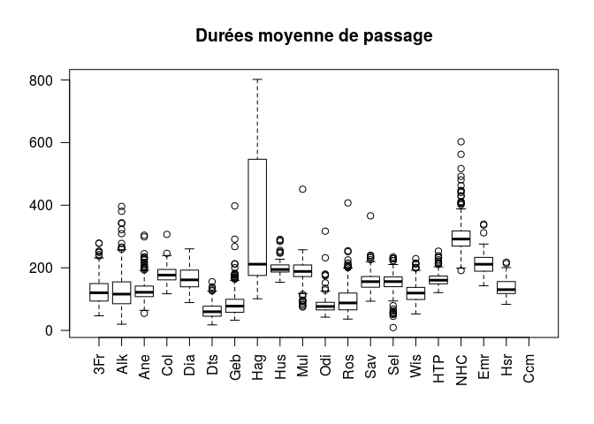
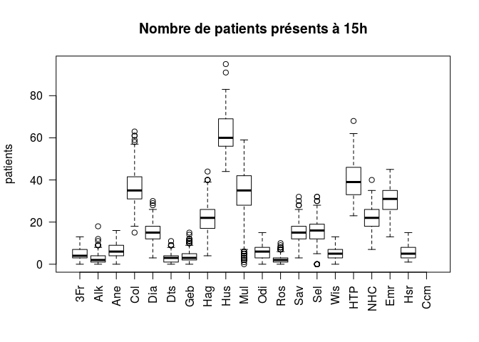
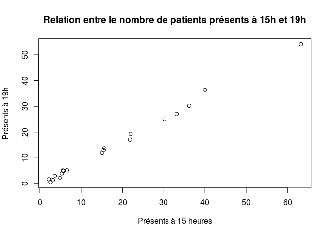

# HET ALSACE
JcB  
03/12/2015  


```
## Loading required package: zoo
```

```
## 
## Attaching package: 'zoo'
```

```
## The following objects are masked from 'package:base':
## 
##     as.Date, as.Date.numeric
```

```
## Loading required package: xtable
```

```
## Loading required package: openintro
```

```
## Please visit openintro.org for free statistics materials
```

```
## 
## Attaching package: 'openintro'
```

```
## The following object is masked from 'package:datasets':
## 
##     cars
```

```
## Loading required package: plotrix
```


Introduction
============

La réunion du 3/12/2015 à l'ARS à fixé les indicateurs devant être suivis pendant la période 2015-2016:

- ahet1: nombre de passages la veille
- ahet2: nombre de passages de patients de plus de 75 ans
- ahet3: durée de passage
- ahet4: taux d'hospitalisation
- ahet5: charge d'occupation à 15 heures

Définitions:
------------
- __Taux d'hospitalisation__: somme MODE_SORTIE = 'Mutation' +  MODE_SORTIE = 'Transfert' / nombre de RPU où le MODE_SORTIE est renseigné.
- __charge d'occupation à 15 heures__: nombre de patients présents à 15 heures / nombre de places d'hébergement de la SU (nb de patients pouvant être installés simultanément dans le service en salle d'examen et en zone d'attente organisée)

Définitions des seuils
----------------------

Les seuils sont calculés à partir de l'historique des données des huits premiers mois de 2015 et des deux derniers mois de 2014.
Pour chaque indicateurs sont calculés la moyenne et l'écart-type par établissement.

Cinq items du RPU sont nécessaires: AGE, DATE_ENTREE, DATE_SORTIE, MODE_SORTIE, FINESS

### Constitution du panel de référence pour le calcul des seuils:


Le panel de référence comporte 501.499 RPU (1/11/2014 au 31/10/2015)

### Calcul des moyennes et écart-types (SD)


Calcul des indicateurs
=======================

ahet1 - nombre total de passages
---------------------------------


```r
# ahet1 - nombre total de passages
# ------------------------

ahet1.n <- tapply(as.Date(dx$ENTREE), list(as.Date(dx$ENTREE), dx$FINESS), length)
ahet1.m <- apply(ahet1.n, 2, mean, na.rm = TRUE)
ahet1.sd <- apply(ahet1.n, 2, sd, na.rm = TRUE)
```


ahet2 - Nombre de passages de 75 ans et plus
--------------------------------------------

```r
# Nombre de passages de 75 ans et plus
# --------------------------------------

# on crée un sous groupe des 75 ans et plus
dx.75 <- dx[dx$AGE > 74,]
ahet2.n <- tapply(as.Date(dx.75$ENTREE), list(as.Date(dx.75$ENTREE), dx.75$FINESS), length)
ahet2.m <- apply(ahet2.n, 2, mean, na.rm = TRUE)
ahet2.sd <- apply(ahet2.n, 2, sd, na.rm = TRUE)
```

ahet3 - Durée de passage
------------------------

On crée un dataframe des durées de passage (Rpu2). Avec tapply, on détermine la durée moyenne de passages par jour et par FINESS. Sur le même principe, on peut calculer une matrice des SD, Median, Min, Max...
On applique _apply_ aux colonnes pour calculer la moyenne et SD annuelle par établissement.

```r
# ahet3 - Durée de passage
# -----------------------

# on crée un dataframe sans la colonne ORIENTATION mais avec la colonne FINESS

dp <- df.duree.pas(dx, orientation = FALSE, finess = TRUE)
head(dp)
```

```
##                     ENTREE              SORTIE MODE_SORTIE AGE FINESS
## 805661 2014-12-01 00:27:00 2014-12-01 01:38:00    Mutation  77    Sel
## 805681 2014-12-01 01:26:00 2014-12-01 02:20:00    Domicile  17    Sel
## 805691 2014-12-01 00:34:00 2014-12-01 02:32:00    Domicile  47    Mul
## 805701 2014-12-01 01:02:00 2014-12-01 11:24:00    Mutation  28    Mul
## 805713 2014-12-01 01:13:00 2014-12-01 02:17:00    Mutation  81    Mul
## 805721 2014-12-01 01:18:00 2014-12-01 02:44:00    Domicile  20    Mul
##        duree        he         hs
## 805661    71    27M 0S  1H 38M 0S
## 805681    54 1H 26M 0S  2H 20M 0S
## 805691   118    34M 0S  2H 32M 0S
## 805701   622  1H 2M 0S 11H 24M 0S
## 805713    64 1H 13M 0S  2H 17M 0S
## 805721    86 1H 18M 0S  2H 44M 0S
```

```r
# durée de passage moyenne par jour et par Finess
ahet3.moy.jour <- tapply(dp$duree, list(as.Date(dp$ENTREE), dp$FINESS), mean, na.rm = TRUE)

ahet3.m <- apply(ahet3.moy.jour, 2, mean, na.rm=TRUE)
ahet3.sd <- apply(ahet3.moy.jour, 2, sd, na.rm=TRUE)

# Pour illustrer:
boxplot(ahet3.moy.jour, las = 2, main = "Durées moyenne de passage")
```




```r
# ahet4 - Taux hospitalisation
# ---------------------------

# On forme un Dataframe de RPU dont le mode de sortie n'est pas nul, appelé ms:
ms <- dx[!is.na(dx$MODE_SORTIE),]
summary(as.factor(ms$MODE_SORTIE))
```

```
##     Décès  Domicile  Mutation Transfert 
##         1    270647     75572      5383
```

```r
# taux d'hospitalisation par FINESS. dx est un vecteur des modes de sortie (non nuls) pour un établissement donné. 
# tx.hosp <- function(dx){s = summary(dx);n = length(dx); hosp = s["Mutation"] + s["Transfert"]; tx = hosp/n; return(tx)}

# taux de transferts par FINESS
tx.trans <- function(dx){s = summary(dx);n = length(dx); trans = s["Transfert"]; tx = trans/n; return(tx)}

# taux d'hospitalisation par établissement sur tute la période
t <- tapply(ms$MODE_SORTIE, ms$FINESS, tx.hosp)
round(t * 100, 2)
```

```
##   3Fr   Alk   Ane   Col   Dia   Dts   Geb   Hag   Hus   Mul   Odi   Ros 
##  8.28 14.32  0.93 24.67 23.12  8.99  9.17 22.66 75.11 18.61  8.93 16.71 
##   Sav   Sel   Wis   HTP   NHC   Emr   Hsr   Ccm 
## 21.16 19.87 21.96 61.36 72.07 19.70 14.55    NA
```

```r
# taux d'hospitalisation par jour et par Finess
t <- tapply(ms$MODE_SORTIE, list(as.Date(ms$ENTREE), ms$FINESS), tx.hosp)
head(round(t * 100, 2))
```

```
##             3Fr   Alk   Ane   Col   Dia Dts   Geb   Hag   Hus   Mul  Odi
## 2014-11-01 0.00    NA 11.11 29.32 21.92   0 25.00 20.75 77.59 15.57 7.04
## 2014-11-02 0.00    NA  0.00 23.64 20.69   0  5.77 22.61 77.78 20.81 1.05
## 2014-11-03 2.78 11.11  0.00 20.50 28.26   0  3.45 30.77 77.22 19.35 7.69
## 2014-11-04 0.00  0.00  0.00 29.27 22.22   0  3.23 34.44 71.83 17.42 7.94
## 2014-11-05 0.00 33.33  0.00 32.88 30.88   0  7.89 27.66 76.19 17.93 3.45
## 2014-11-06 0.00  6.25  0.00 27.78 29.87   0  0.00 29.41 79.31 14.71 2.44
##              Ros   Sav   Sel   Wis HTP NHC Emr Hsr Ccm
## 2014-11-01 17.39 11.59    NA 22.50  NA  NA  NA  NA  NA
## 2014-11-02 16.67 13.41    NA 19.44  NA  NA  NA  NA  NA
## 2014-11-03  9.09 31.51 25.24 18.75  NA  NA  NA  NA  NA
## 2014-11-04 18.75 24.64 21.54 23.08  NA  NA  NA  NA  NA
## 2014-11-05 25.93 18.75 26.03 17.65  NA  NA  NA  NA  NA
## 2014-11-06 13.33 16.18 32.05 37.50  NA  NA  NA  NA  NA
```

```r
# indicateur
ahet4.m <- apply(t, 2, mean, na.rm = TRUE)
ahet4.sd <- apply(t, 2, sd, na.rm = TRUE)

# ahet4.2 - taux de transferts
t <- tapply(ms$MODE_SORTIE, ms$FINESS, tx.trans)
round(t * 100, 2)
```

```
##  3Fr  Alk  Ane  Col  Dia  Dts  Geb  Hag  Hus  Mul  Odi  Ros  Sav  Sel  Wis 
## 0.87 1.28 0.93 1.71 2.93 0.03 4.09 2.07 1.80 0.39 1.97 3.26 1.30 0.00 1.84 
##  HTP  NHC  Emr  Hsr  Ccm 
## 0.61 1.96 0.60 0.00   NA
```

```r
# Aahet5: charge d'occupation à 15 heures
# --------------------------------------

# on utilise dp (voir ahet3)
# on crée une colonne supplémentaire de boolean
dp$present.a.15h <- is.present.at(dp)
# nb de patients présents à 15h par jour et par Finess
n.p15 <- tapply(dp$present.a.15h, list(as.Date(dp$ENTREE), dp$FINESS), sum)
head(n.p15)
```

```
##            3Fr Alk Ane Col Dia Dts Geb Hag Hus Mul Odi Ros Sav Sel Wis HTP
## 2014-11-01   0  NA  11  40  24   0   5  20  58  45   1   7  10  NA   4  NA
## 2014-11-02   2  NA   3  30  13   1   0  16  61  37   8   2  14  NA   3  NA
## 2014-11-03   9   1  11  32  28   7   2  16  59  43   7   2  15  19   7  NA
## 2014-11-04   7   1   2  33  11   2   2  14  66  48  10   2  20   5   9  NA
## 2014-11-05   3   1   6  24  15   1   7  29  55  41   3   0  13   9   0  NA
## 2014-11-06  12   4   7  32  12   1   2  26  55  42  14   0  17  16   2  NA
##            NHC Emr Hsr Ccm
## 2014-11-01  NA  NA  NA  NA
## 2014-11-02  NA  NA  NA  NA
## 2014-11-03  NA  NA  NA  NA
## 2014-11-04  NA  NA  NA  NA
## 2014-11-05  NA  NA  NA  NA
## 2014-11-06  NA  NA  NA  NA
```

```r
# nombre moyen et SD de patients présents à 15 heures
ahet5.m <- apply(n.p15, 2, mean, na.rm = TRUE)
ahet5.sd <- apply(n.p15, 2, sd, na.rm = TRUE)

# Représentation graphique
boxplot(n.p15, las = 2, main = "Nombre de patients présents à 15h", ylab = "patients")
```



```r
# Nombre de patients présents à 19 heures et corrélation avec 15 heures
dp$present.a.19h <- is.present.at(dp, "19:00:00")
n.p19 <- tapply(dp$present.a.19h, list(as.Date(dp$ENTREE), dp$FINESS), sum)
apply(n.p19, 2, mean, na.rm = TRUE)
```

```
##        3Fr        Alk        Ane        Col        Dia        Dts 
##  2.3232877  0.5779037  5.2711864 30.2225275 12.9123288  1.2994505 
##        Geb        Hag        Hus        Mul        Odi        Ros 
##  3.0849315 17.1287671 54.0163934 27.0533333  5.0589888  1.6191781 
##        Sav        Sel        Wis        HTP        NHC        Emr 
## 11.9095890 13.7923977  4.0739726 36.3684211 19.3125000 24.9382716 
##        Hsr        Ccm 
##  5.2166667        NaN
```

```r
ahet5.19 <- apply(n.p19, 2, mean, na.rm = TRUE)
cor.test(ahet5.m, ahet5.19)
```

```
## 
## 	Pearson's product-moment correlation
## 
## data:  ahet5.m and ahet5.19
## t = 64.027, df = 17, p-value < 2.2e-16
## alternative hypothesis: true correlation is not equal to 0
## 95 percent confidence interval:
##  0.9945021 0.9992237
## sample estimates:
##      cor 
## 0.997933
```

```r
plot(ahet5.m, ahet5.19, main = "Relation entre le nombre de patients présents à 15h et 19h", xlab = "Présents à 15 heures", ylab = "Présents à 19h")
```



```r
# nombre de patients entrés et présents à 15 h


# Regroupment des indicapeurs: on forme une matrice des indicateurs moyens et des Finess
# -------------------------------------------------------------------------------------------------
tab.m <- cbind(ahet1.m, ahet2.m, ahet3.m, ahet4.m, ahet5.m)
round(tab.m,2)
```

```
##     ahet1.m ahet2.m ahet3.m ahet4.m ahet5.m
## 3Fr   47.33    5.41  125.37    0.08    4.82
## Alk   46.61    6.84  124.05    0.13    2.56
## Ane   46.46    4.38  128.00    0.01    6.55
## Col  186.25   23.76  179.47    0.25   36.14
## Dia   79.85   11.95  165.55    0.23   15.47
## Dts   33.03    1.98   63.29    0.08    3.09
## Geb   43.68    4.58   84.53    0.09    3.58
## Hag  126.42   17.62  324.29    0.23   21.82
## Hus  305.26   41.15  202.17    0.75   63.28
## Mul  162.20   23.09  188.41    0.18   33.16
## Odi   68.70    4.07   80.10    0.09    5.68
## Ros   22.27    1.85   96.69    0.17    2.16
## Sav   81.50   11.48  156.17    0.21   15.10
## Sel   83.70   12.81  154.81    0.19   15.63
## Wis   36.21    6.31  120.51    0.22    5.28
## HTP  216.31   20.33  162.55    0.72   40.01
## NHC   89.09   20.78  298.48    0.75   21.98
## Emr  138.15   22.48  214.00    0.20   30.17
## Hsr   40.50     NaN  135.69    0.15    5.57
## Ccm     NaN     NaN     NaN     NaN     NaN
```

```r
tab.sd <- cbind(ahet1.sd, ahet2.sd, ahet3.sd, ahet4.sd, ahet5.sd)
round(tab.sd,2)
```

```
##     ahet1.sd ahet2.sd ahet3.sd ahet4.sd ahet5.sd
## 3Fr     8.09     2.34    42.50     0.08     2.77
## Alk     8.29     2.83    59.65     0.15     2.34
## Ane     9.33     2.22    32.62     0.04     3.21
## Col    20.61     5.29    24.27     0.04     8.16
## Dia     9.14     4.00    35.93     0.07     4.62
## Dts     8.65     1.19    24.10     0.12     2.18
## Geb     8.24     2.25    40.44     0.07     2.65
## Hag    15.94     4.73   197.82     0.05     6.33
## Hus    24.26     7.40    28.33     0.07    10.68
## Mul    49.37     6.06    35.78     0.04    13.42
## Odi    17.56     1.99    25.03     0.06     2.89
## Ros     7.35     1.02    43.28     0.11     1.92
## Sav    11.62     3.82    28.83     0.05     4.78
## Sel    22.33     3.89    29.83     0.07     5.63
## Wis     7.95     2.87    29.66     0.08     2.62
## HTP    23.02     4.95    20.71     0.18     8.84
## NHC    12.80     4.85    53.35     0.15     5.31
## Emr    13.70     4.08    36.34     0.04     6.82
## Hsr     9.25       NA    29.78     0.07     3.04
## Ccm       NA       NA       NA       NA       NA
```

```r
write.csv(tab.m, file = "het_mean.csv")
write.csv(tab.sd, file = "het_sd.csv")
```


