# Test des indicateurs HET
JcB  
09/11/2015  

Indicateurs Champagne Ardennes
==============================

L'ORUCA a retenu 5 indicateurs:

- HET1: disponibilité en lit médecine + chir (source manuelle ou ROR) [FEDORU 4.1]
- HET2: Le nombre de passages aux urgences à J-1 [FEDORU 2.2]
- HET3: moyenne des durées de passage des patients hospitalisés à partir des urgences J-1
- HET4: taux d'hospitalisation après passage aux urgences (nb d'hospitalisation / nb de passages) J-1
- HET5: charge d'occupation à 15 heures / capacité d'accueil du service des urgences (nb de patients pouvant être installés simultanément dans le service en salle d'examen et en zone d'attente organisée)

La FEDORU propose 7 indicateurs:

- FHET1: Nombre de passage sur les dernières 24 heures [2.2 = HET2]
- FHET2: Nombre de patients présents à un instant donné [2.3 = HET5 ?] par 10 mn
- FHET3: Nombre de patients présents de plus de 75 ans [2.4] par 10 mn
- FHET4: Durée moyenne de présence aux urgences [2.11 = HET3] par 10 mn
- FHET5: Nombre de transferts par défaut de lits sur les 3 derniers jours [3.6]
- FHET6: Nombre d'hospitalisations à partir des urgences [3.7 = HET4]
- FHET7: Nombre de lits disponibles par service [4.1 = HRT1] par 10 mn

Résultats disponibles:

- synthèse régionale du radar de chaque établissement
- détail du radar avec tableau de données chiffrées pour chaque établissement
- détail de chaque indicateur pour chaque établissement avec courbe historique des 30 derniers jours (et moyenne lissée)


```r
fichier <- "../../DATA/data_test.Rda" # supprimer ../ en mode console
load(fichier) # dx

library(lubridate)
library(xts)
library(Rpu2)

source("duree_passage.R") # si console: source("Indicateurs/duree_passage.R")

# masquer cette ligne pour faire le calcul avec tous les établissements
dx <- dx[dx$FINESS == "Wis",]

# création d'un calendrier pour le période (nécessaire pour transformer en time serie xts)
x <- seq(min(as.Date(dx$ENTREE)), max(as.Date(dx$ENTREE)), 1)
```

HET2 - Nombre de passages aux urgences (par jour)
------------------------------------------


```r
n.rpu.jour <- tapply(as.Date(dx$ENTREE), day(as.Date(dx$ENTREE)), length)

# transformation en time serie
x <- seq(min(as.Date(dx$ENTREE)), max(as.Date(dx$ENTREE)), 1)
ts.het2 <- xts(n.rpu.jour, order.by = x)
colnames(ts.het2) <- "HET2"

head(ts.het2)
```

```
##            HET2
## 2015-10-01   31
## 2015-10-02   41
## 2015-10-03   39
## 2015-10-04   46
## 2015-10-05   51
## 2015-10-06   31
```

```r
plot(ts.het2, main = "Nombre quotidien de passages", type = "b", pch = 21, bg = "yellow")

abline(h = mean(ts.het2), lty = 2, col = "red") # moyenne
lines(rollmean(ts.het2, k = 7), col = "green", lwd = 3)
```

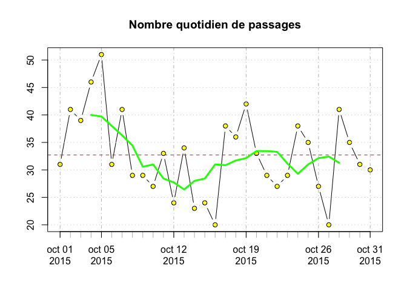

```r
# Répartition normale ?
summary(n.rpu.jour)
```

```
##    Min. 1st Qu.  Median    Mean 3rd Qu.    Max. 
##   20.00   28.00   31.00   32.71   38.00   51.00
```

```r
sd(n.rpu.jour)
```

```
## [1] 7.439505
```

```r
hist(n.rpu.jour)
```


Graphe avec les WE: on utilise zoo car abline ne fonctionne pas avec xts ?


```r
we <- x[wday(x) %in% c(1,7)]
plot(zoo(ts.het2))
abline(v = as.Date(we), lty = 2, col = "red")
```

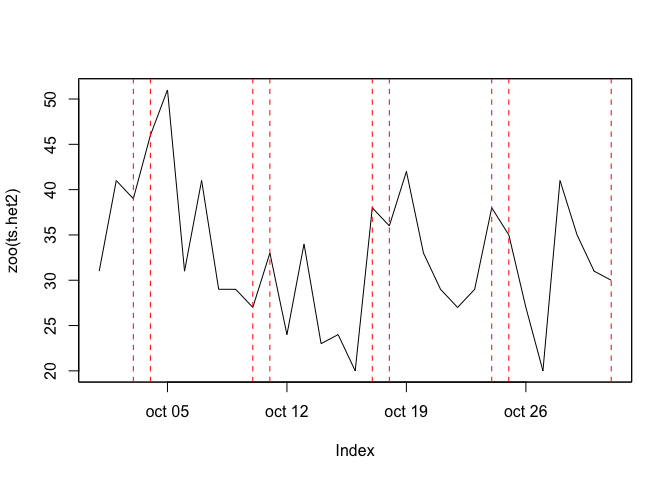

HET3: moyenne des durées de passage des patients hospitalisés à partir des urgences
-----------------------------------------------------------------------------------


```r
# sélectionne les enregistrements où le MODE_SORTIE correspond à une hospitalisation 
hosp <- dx[!is.na(dx$MODE_SORTIE) & dx$MODE_SORTIE %in% c("Mutation", "Transfert"), ]

# durée de passage si hospitalisation
dp <- df.duree.pas(hosp, unit = "mins", mintime = 0, maxtime = 3)

# moyenne quotidienne
mean.dp <- tapply(dp$duree , day(as.Date(dp$ENTREE)), mean)

# transformation en time serie
ts.mean.dp <- xts(mean.dp, x)
colnames(ts.mean.dp) <- "HET3"

par(mar = c(2,4,2,5))
plot(ts.het2, ylab = "Nombre de passages", main = "Nombre de passages et durée de passage")
par(new=TRUE)
# l'objet xts est transformé en zoo qui accepte la couleur
plot(zoo(ts.mean.dp), xaxt="n",xlab="",ylab="", main = "", yaxt="n", lty = 2, col = "blue")
axis(4)
mtext("HET3 - Durée moyenne de passage avant hospitalisation (mn)",side=4,line=3, col = "blue")
```

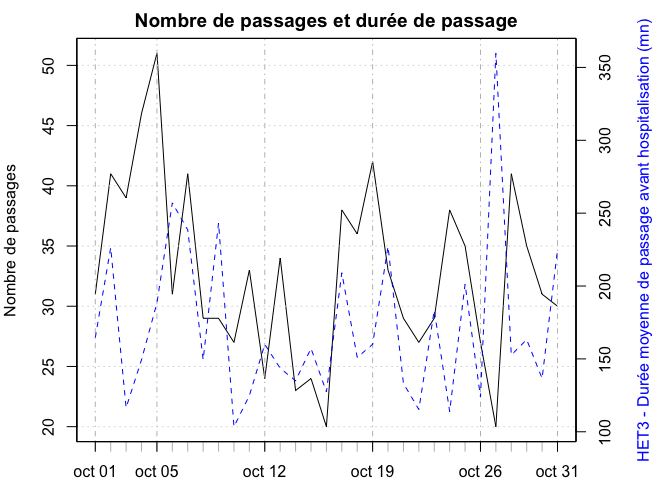

HET4: taux d'hospitalisation après passage aux urgences (nb d'hospitalisation / nb de passages)
-----------------------------------------------------------------------------------------------


```r
n.hosp.jour <- tapply(as.Date(hosp$ENTREE), day(as.Date(hosp$ENTREE)), length)
tx.hosp <- n.hosp.jour / n.rpu.jour
ts.tx.hosp <- xts(tx.hosp, x)
colnames(ts.tx.hosp) <- "HET4"
plot(ts.tx.hosp, main = "HET4 - Taux d'hospitalisation", ylab = "%")
abline(h = mean(ts.tx.hosp), col = "red")
sd1 <- mean(ts.tx.hosp) + sd(ts.tx.hosp)
sd2 <- mean(ts.tx.hosp) + sd(ts.tx.hosp) * 2
sd3 <- mean(ts.tx.hosp) + sd(ts.tx.hosp) * 3
abline(h = sd1, col = "green")
abline(h = sd2, col = "orange")
abline(h = sd3, col = "red")
lines(rollmean(ts.tx.hosp, 7), col = "blue", lwd = 2)
legend("bottomright", legend = c("moyenne générale", "moyenne lissée",  "1 SD", "2 SD", "3 SD"), col = c("red","blue","green","orange", "red"), lty = 1, lwd = 2, cex = 0.8)
```

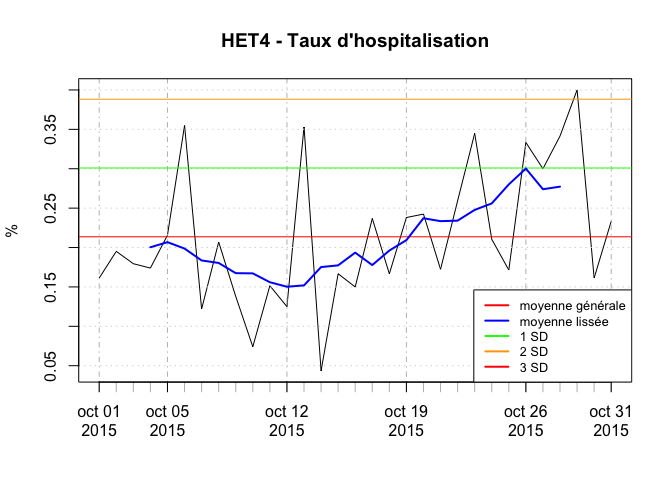

HET5 - charge d'occupation à 15 heures / capacité d'accueil du service des urgences 
----------------------------------------------------------------------------

```r
dp$present.a.15h <- is.present.at(dp)
# nombre moyen de patients présents à 15h tous les jours
n.p15 <- tapply(dp$present.a.15h, yday(as.Date(dp$ENTREE)), sum)

# Transformation en TS
ts.n.p15 <- xts(n.p15, x)
colnames(ts.n.p15) <- "HET5"
plot(ts.n.p15, main = "Nombre de patients présents au SU à 15 heures")
```


Synthèse
--------


```r
a <- cbind(ts.het2, ts.mean.dp, ts.tx.hosp, ts.n.p15)
head(a)
```

```
##            HET2     HET3      HET4 HET5
## 2015-10-01   31 164.6000 0.1612903    0
## 2015-10-02   41 226.3750 0.1951220    3
## 2015-10-03   39 116.5000 0.1794872    1
## 2015-10-04   46 149.3750 0.1739130    1
## 2015-10-05   51 188.3636 0.2156863    1
## 2015-10-06   31 257.1000 0.3548387    3
```

```r
a[1, ]
```

```
##            HET2  HET3      HET4 HET5
## 2015-10-01   31 164.6 0.1612903    0
```

```r
#radial.plot(a[1, ], labels=ion.names,rp.type="p",main="Diagramme indicateurs HET", grid.unit="%",radial.lim=c(0, 5),poly.col="yellow",show.grid.labels=1)
```

Corrélation taux hospitalisation et nombre de passages, et durée de passage
---------------------------------------------------------------------------


```r
# corrélation entre la durée moyenne de passage quotidienne et le nombre de présents à 15h
plot(mean.dp, n.p15, main = "Corrélation durée moyenne de passage quotidienne\n et le nombre de présents à 15h", col ="black", pch = 15)
cor(mean.dp, n.p15)
```

```
## [1] 0.2490515
```

```r
y <- lm(mean.dp ~ n.p15)
y
```

```
## 
## Call:
## lm(formula = mean.dp ~ n.p15)
## 
## Coefficients:
## (Intercept)        n.p15  
##      153.24        12.29
```

```r
summary(y)
```

```
## 
## Call:
## lm(formula = mean.dp ~ n.p15)
## 
## Residuals:
##    Min     1Q Median     3Q    Max 
## -74.81 -38.65 -16.15  33.55 194.14 
## 
## Coefficients:
##             Estimate Std. Error t value Pr(>|t|)    
## (Intercept)  153.238     16.865   9.086 5.54e-10 ***
## n.p15         12.287      8.873   1.385    0.177    
## ---
## Signif. codes:  0 '***' 0.001 '**' 0.01 '*' 0.05 '.' 0.1 ' ' 1
## 
## Residual standard error: 54.46 on 29 degrees of freedom
## Multiple R-squared:  0.06203,	Adjusted R-squared:  0.02968 
## F-statistic: 1.918 on 1 and 29 DF,  p-value: 0.1767
```

```r
abline(y)
```

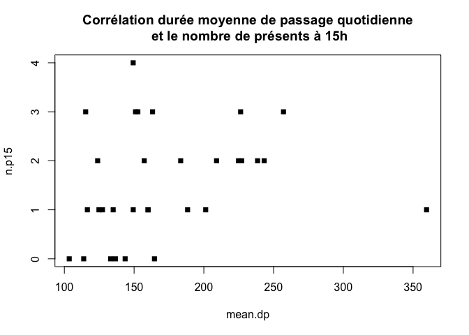

```r
# corrélation entre la duréee moyenne de passage et le nombre total de passages
cor(mean.dp, n.rpu.jour)
```

```
## [1] -0.02570271
```

```r
# corrélation entre taux hospitalisation et nombre de passages
cor(tx.hosp, n.rpu.jour)
```

```
## [1] 0.1218142
```

```r
y <- lm(n.rpu.jour ~ tx.hosp)
y
```

```
## 
## Call:
## lm(formula = n.rpu.jour ~ tx.hosp)
## 
## Coefficients:
## (Intercept)      tx.hosp  
##       30.49        10.38
```

```r
summary(y)
```

```
## 
## Call:
## lm(formula = n.rpu.jour ~ tx.hosp)
## 
## Residuals:
##     Min      1Q  Median      3Q     Max 
## -13.606  -4.666  -1.166   5.186  18.269 
## 
## Coefficients:
##             Estimate Std. Error t value Pr(>|t|)    
## (Intercept)   30.492      3.616   8.432 2.72e-09 ***
## tx.hosp       10.379     15.705   0.661    0.514    
## ---
## Signif. codes:  0 '***' 0.001 '**' 0.01 '*' 0.05 '.' 0.1 ' ' 1
## 
## Residual standard error: 7.51 on 29 degrees of freedom
## Multiple R-squared:  0.01484,	Adjusted R-squared:  -0.01913 
## F-statistic: 0.4368 on 1 and 29 DF,  p-value: 0.5139
```

```r
plot(tx.hosp, n.rpu.jour, col ="black", pch = 15)
abline(y)
```


Radar
=====


```r
source("../het.R")

a <- cbind(0, ts.het2, ts.mean.dp, ts.tx.hosp, ts.n.p15)
head(a)
```

```
##            X0 HET2     HET3      HET4 HET5
## 2015-10-01  0   31 164.6000 0.1612903    0
## 2015-10-02  0   41 226.3750 0.1951220    3
## 2015-10-03  0   39 116.5000 0.1794872    1
## 2015-10-04  0   46 149.3750 0.1739130    1
## 2015-10-05  0   51 188.3636 0.2156863    1
## 2015-10-06  0   31 257.1000 0.3548387    3
```

```r
a[1, ]
```

```
##            X0 HET2  HET3      HET4 HET5
## 2015-10-01  0   31 164.6 0.1612903    0
```

```r
# normalisation sous forme de variable centrée et réduite. Par défaut, moyenne et sd sont calculés à partir de l'échantillon de départ. Arbitrairement la moyenne graphique est fixée à 5.

m <- 5
a[, 1] <- m # arbitraire faute de mieux
a[, 2] <- m + (a[, 2] - mean(n.rpu.jour)) / sd(n.rpu.jour)
a[, 3] <- m +  (a[, 3] - mean(mean.dp)) / sd(mean.dp)
a[, 4] <- m +  (a[, 4] - mean(ts.tx.hosp)) / sd(ts.tx.hosp)
a[, 5] <- m +  (a[, 5] - mean(n.p15)) / sd(n.p15)

# indicateurs pour le mois d'octobre 2015
for(i in 1:30){
    radar.het(a[i,])
}
```

```
## Warning in if (class(vx) == "xts") jour <- index(b)[1] else jour <- date:
## la condition a une longueur > 1 et seul le premier élément est utilisé

## Warning in if (class(vx) == "xts") jour <- index(b)[1] else jour <- date:
## la condition a une longueur > 1 et seul le premier élément est utilisé
```


```
## Warning in if (class(vx) == "xts") jour <- index(b)[1] else jour <- date:
## la condition a une longueur > 1 et seul le premier élément est utilisé
```

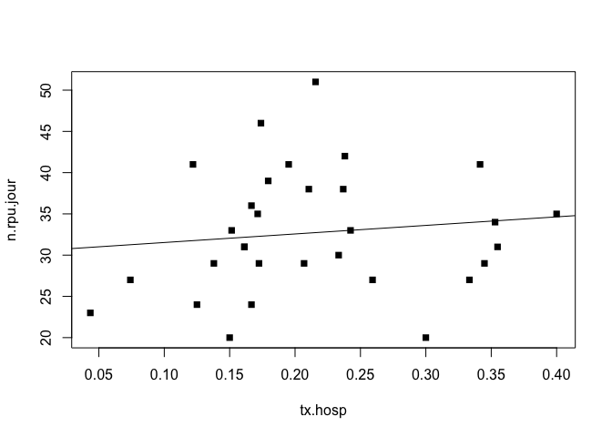

```
## Warning in if (class(vx) == "xts") jour <- index(b)[1] else jour <- date:
## la condition a une longueur > 1 et seul le premier élément est utilisé
```

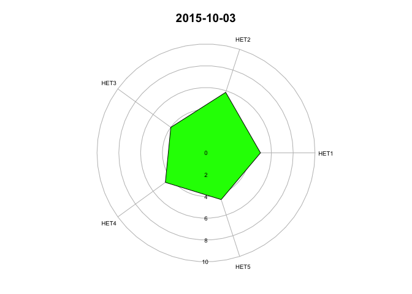

```
## Warning in if (class(vx) == "xts") jour <- index(b)[1] else jour <- date:
## la condition a une longueur > 1 et seul le premier élément est utilisé
```

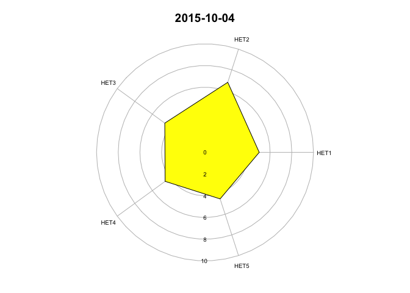

```
## Warning in if (class(vx) == "xts") jour <- index(b)[1] else jour <- date:
## la condition a une longueur > 1 et seul le premier élément est utilisé
```


```
## Warning in if (class(vx) == "xts") jour <- index(b)[1] else jour <- date:
## la condition a une longueur > 1 et seul le premier élément est utilisé
```

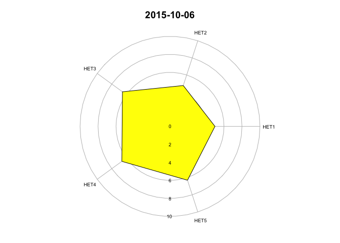

```
## Warning in if (class(vx) == "xts") jour <- index(b)[1] else jour <- date:
## la condition a une longueur > 1 et seul le premier élément est utilisé
```

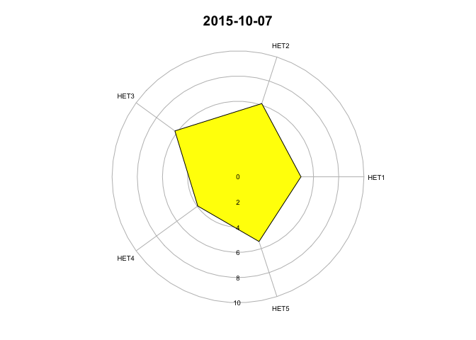

```
## Warning in if (class(vx) == "xts") jour <- index(b)[1] else jour <- date:
## la condition a une longueur > 1 et seul le premier élément est utilisé
```


```
## Warning in if (class(vx) == "xts") jour <- index(b)[1] else jour <- date:
## la condition a une longueur > 1 et seul le premier élément est utilisé
```


```
## Warning in if (class(vx) == "xts") jour <- index(b)[1] else jour <- date:
## la condition a une longueur > 1 et seul le premier élément est utilisé
```


```
## Warning in if (class(vx) == "xts") jour <- index(b)[1] else jour <- date:
## la condition a une longueur > 1 et seul le premier élément est utilisé
```

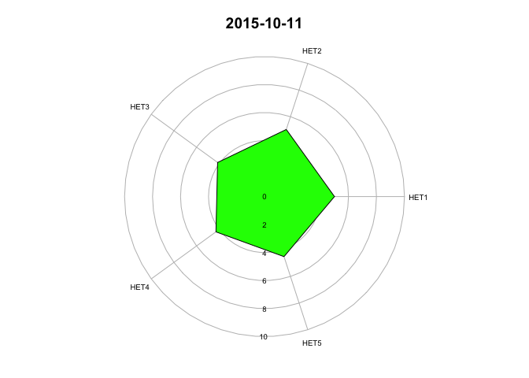

```
## Warning in if (class(vx) == "xts") jour <- index(b)[1] else jour <- date:
## la condition a une longueur > 1 et seul le premier élément est utilisé
```


```
## Warning in if (class(vx) == "xts") jour <- index(b)[1] else jour <- date:
## la condition a une longueur > 1 et seul le premier élément est utilisé
```


```
## Warning in if (class(vx) == "xts") jour <- index(b)[1] else jour <- date:
## la condition a une longueur > 1 et seul le premier élément est utilisé
```


```
## Warning in if (class(vx) == "xts") jour <- index(b)[1] else jour <- date:
## la condition a une longueur > 1 et seul le premier élément est utilisé
```


```
## Warning in if (class(vx) == "xts") jour <- index(b)[1] else jour <- date:
## la condition a une longueur > 1 et seul le premier élément est utilisé
```

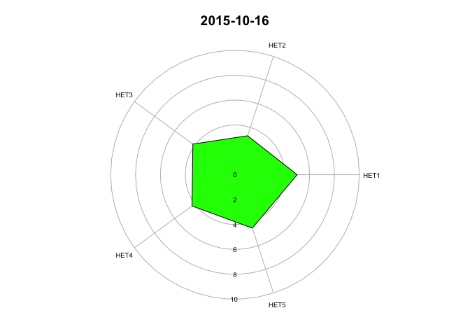

```
## Warning in if (class(vx) == "xts") jour <- index(b)[1] else jour <- date:
## la condition a une longueur > 1 et seul le premier élément est utilisé
```

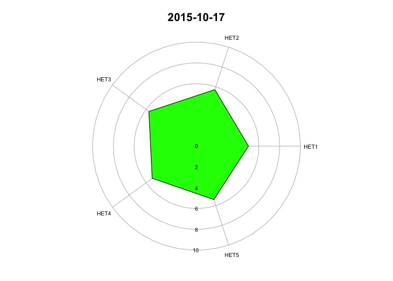

```
## Warning in if (class(vx) == "xts") jour <- index(b)[1] else jour <- date:
## la condition a une longueur > 1 et seul le premier élément est utilisé
```

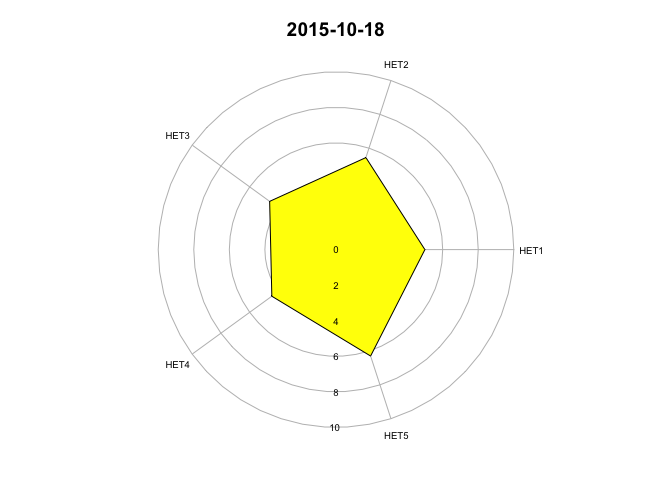

```
## Warning in if (class(vx) == "xts") jour <- index(b)[1] else jour <- date:
## la condition a une longueur > 1 et seul le premier élément est utilisé
```

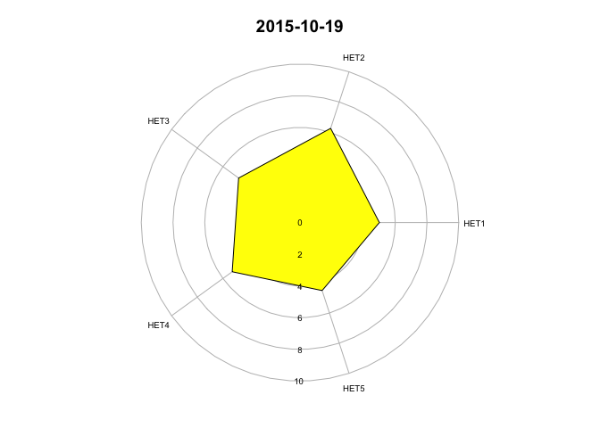

```
## Warning in if (class(vx) == "xts") jour <- index(b)[1] else jour <- date:
## la condition a une longueur > 1 et seul le premier élément est utilisé
```

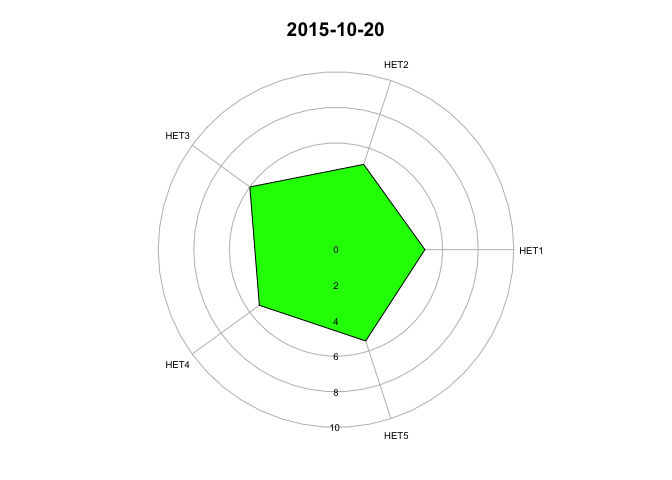

```
## Warning in if (class(vx) == "xts") jour <- index(b)[1] else jour <- date:
## la condition a une longueur > 1 et seul le premier élément est utilisé
```

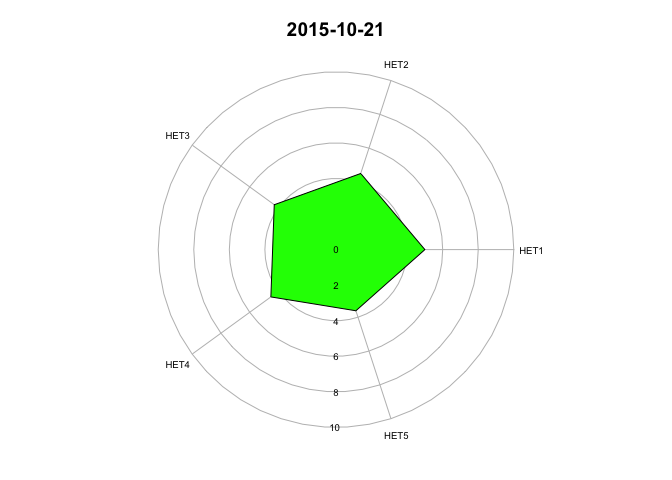

```
## Warning in if (class(vx) == "xts") jour <- index(b)[1] else jour <- date:
## la condition a une longueur > 1 et seul le premier élément est utilisé
```

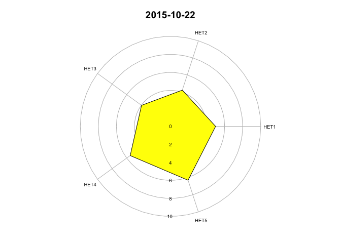

```
## Warning in if (class(vx) == "xts") jour <- index(b)[1] else jour <- date:
## la condition a une longueur > 1 et seul le premier élément est utilisé
```

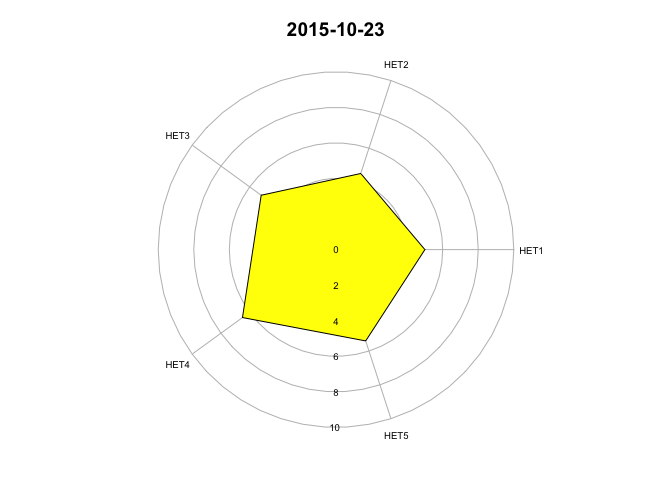

```
## Warning in if (class(vx) == "xts") jour <- index(b)[1] else jour <- date:
## la condition a une longueur > 1 et seul le premier élément est utilisé
```


```
## Warning in if (class(vx) == "xts") jour <- index(b)[1] else jour <- date:
## la condition a une longueur > 1 et seul le premier élément est utilisé
```


```
## Warning in if (class(vx) == "xts") jour <- index(b)[1] else jour <- date:
## la condition a une longueur > 1 et seul le premier élément est utilisé
```


```
## Warning in if (class(vx) == "xts") jour <- index(b)[1] else jour <- date:
## la condition a une longueur > 1 et seul le premier élément est utilisé
```

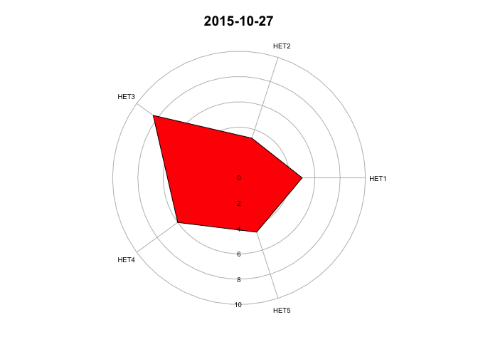

```
## Warning in if (class(vx) == "xts") jour <- index(b)[1] else jour <- date:
## la condition a une longueur > 1 et seul le premier élément est utilisé
```

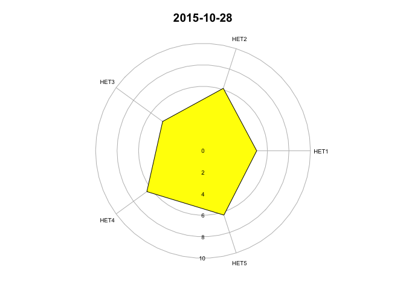

```
## Warning in if (class(vx) == "xts") jour <- index(b)[1] else jour <- date:
## la condition a une longueur > 1 et seul le premier élément est utilisé
```

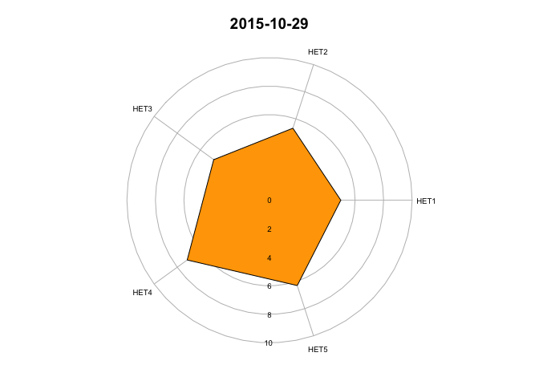

Calcul des moyennes de référence par établissement
===================================================

La période de référence retenue s'étend du 1er novembre 2014 au 31 octobre 2015
```{}
load("~/Documents/Stat Resural/RPU_2014/rpu2014d0112_c2.Rda")
load("~/Documents/Stat Resural/RPU_2014/rpu2015d0112_provisoire.Rda")
d1 <- d14[as.Date(d14$ENTREE) > "2014-10-31",]
d2 <- d15[as.Date(d15$ENTREE) < "2015-11-01",]
# combinaison de d1 et d2 crée la période de référence
ref <- rbind(d1, d2)

# HET2
# ====
# Nombre de RPU par jours et par FINESS pendant la période de référence
ref.het2.n <- tapply(as.Date(ref$ENTREE), list(yday(as.Date(ref$ENTREE)), ref$FINESS), length)
# calcul de la moyenne/sd du nb de RPU par jours et par FINESS
ref.het2.m <- apply(ref.het2.n, 2, mean, na.rm = TRUE)
ref.het2.sd <- apply(ref.het2.n, 2, sd, na.rm = TRUE)

# HET3
# ====
# sélectionne les enregistrements où le MODE_SORTIE correspond à une hospitalisation 
hosp <- ref[!is.na(ref$MODE_SORTIE) & ref$MODE_SORTIE %in% c("Mutation", "Transfert"), ]
# durée de passage si hospitalisation
dp <- df.duree.pas(hosp, unit = "mins", mintime = 0, maxtime = 3, finess = TRUE)

# moyenne/sd par FINESS
ref.het3.m <- tapply(dp$duree , dp$FINESS, mean, na.rm = TRUE)
ref.het3.sd <- tapply(dp$duree , dp$FINESS, sd, na.rm = TRUE)

# HET4
# ====
n.hosp.jour <- tapply(as.Date(hosp$ENTREE), list(yday(as.Date(hosp$ENTREE)), hosp$FINESS), length)
tx.hosp <- n.hosp.jour / ref.het2.n
# moyenne/sd par FINESS
ref.het4.m <- apply(tx.hosp, 2, mean, na.rm = TRUE)
ref.het4.sd <- apply(tx.hosp, 2, sd, na.rm = TRUE)

# HET5
# ====
dp$present.a.15h <- is.present.at(dp) # vecteur de TRUE/FALSE
# nombre de patients présents à 15h tous les jours par FINESS <- CORRECTION ?
n.p15 <- tapply(dp$present.a.15h, yday(as.Date(dp$ENTREE)), sum)
n.p15 <- tapply(dp$present.a.15h, list(yday(as.Date(dp$ENTREE)), dp$FINESS), sum)
# moyenne/sd par FINESS
ref.het5.m <- apply(n.p15, 2, mean, na.rm = TRUE)
ref.het5.sd <- apply(n.p15, 2, sd, na.rm = TRUE)

# Synthèse
ref.df <- cbind(ref.het2.m, ref.het2.sd, ref.het3.m, ref.het3.sd, ref.het4.m, ref.het4.sd, ref.het5.m, ref.het5.sd)

# Sauvegarde
write.csv(ref.df, file = "ref_het_2015.csv")

```
Note: les taux d'hospitalisation pourles HUS sont anormalement bas. Du à défauut de remplissage de la rubrique Mode_Sortie. Corrigé en Décembre 2015 (par défaut, mode de sortie = domicile).

Récupération des données:

- moyenne des passages: ref.df["FINESS", "indicateur"] ex. ref.df["3Fr","ref.het2.m"]

Indicateurs du jour
===================

Démarche générale
------------------

Pour calculer les indicateurs du jour, il faut deux informations:

- un dataframe avec les RPU du jour
- les moyennes et ecarts-type de chaque indicateur

La procédure qui suit  est formalisée dabns la routine __indicateurs.jour__.

Récupère les données 2016:
    


```r
# indicateur pour la journée
het2 <- 5 + (h2 - ref.df[,"ref.het2.m"]) / ref.df[,"ref.het2.sd"]

# HET3: durée de passage si hospitalisation
# sélectionne les enregistrements où le MODE_SORTIE correspond à une hospitalisation 
hosp <- d[!is.na(d$MODE_SORTIE) & d$MODE_SORTIE %in% c("Mutation", "Transfert"), ]
# durée de passage moyenne si hospitalisation par Finess
dp <- df.duree.pas(hosp, unit = "mins", mintime = 0, maxtime = 3, finess = TRUE)
h3 <- tapply(dp$duree, dp$FINESS, mean, na.rm = TRUE)
# indicateur pour la journée
het3 <- 5 + (h3 - ref.df[,"ref.het3.m"]) / ref.df[,"ref.het3.sd"]

# HET4: taux hospitalisation
# nb d'hospitalisation par Finess
n.hosp <- table(hosp$FINESS)
# taux hospitalisation
h4 <- n.hosp / h2
# indicateur pour la journée
het4 <- 5 + (h4 - ref.df[,"ref.het4.m"]) / ref.df[,"ref.het4.sd"]

# HET5: Charge de soins à 15 heures
dp$present.a.15h <- is.present.at(dp) # vecteur de TRUE/FALSE
h5 <- tapply(dp$present.a.15h, dp$FINESS, sum)
# indicateur pour la journée
het5 <- 5 + (h5 - ref.df[,"ref.het5.m"]) / ref.df[,"ref.het5.sd"]

# Synthèse
het1 <- 5
a <- cbind(het1, het2, het3, het4, het5)
a
```

```
##     het1     het2     het3     het4     het5
## 3Fr    5 5.947835 4.422145 5.187873 4.183871
## Alk    5 4.564623 4.262764 4.151651 4.210753
## Ane    5 4.736707       NA 1.267123       NA
## Ccm    5       NA       NA       NA       NA
## Col    5 4.696909 4.751047 3.258661 3.886706
## Dia    5 2.937602 4.997500 6.205523 6.221992
## Dts    5 4.302432       NA 3.501492       NA
## Emr    5 4.259038 4.629877 4.074193 3.638401
## Geb    5 5.159602 4.556279 4.197124 4.311392
## Hag    5 6.102857 4.782300 4.134888 4.533703
## Hsr    5 5.918481 4.993940 4.534439 3.927533
## HTP    5 5.073595 5.162404 3.249631 3.140337
## NHC    5 5.149532 5.522342 4.253203 5.366922
## Odi    5 8.662634 4.690710 4.202958 4.682992
## Ros    5 3.874906 4.568560 5.627043 4.506060
## Sav    5 4.526769 4.848208 2.875853 3.327272
## Sel    5 5.192439 5.172231 5.019128 5.189088
## Wis    5 4.471283 4.950517 4.654922 4.355842
```

```r
# transformation des NA en 0
na2zero <- function(x){ifelse(is.na(x), 0, x)}
b <- na2zero(a)

# on supprime Hus et Mul
# b <-b[-c(9:10),]
```

Affichage HET du jour
---------------------
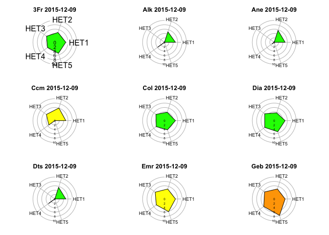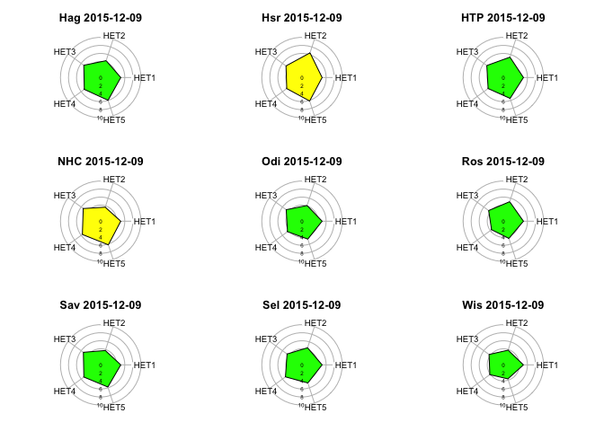

Utilisation de la routine indicateurs.jour
------------------------------------------

Récupère les données 2016:


Indicateurs pour Sélestat le 10/1/2016:

```r
# source('~/Documents/Resural/Stat Resural/HET/het.R')
finess <- "Sel"
jour <- as.Date("2016-01-10")
```

Indicateurs du jour

```r
data <- dx[as.Date(dx$ENTREE) == jour & dx$FINESS == finess,]
het.jour <- indicateurs.jour(data)
het.jour
```

```
##        HET1        HET2        HET3        HET4        HET5 
##   0.0000000  88.0000000 182.9500000   0.2045455  22.0000000
```


Récupération des moyennes et sd:

```r
# lecture du fichier de référence des moyennes et ecarts-type
ref.df <- read.csv("../ref_het_2015.csv")
# on retire Hus et Mul
ref.df <- ref.df[-c(9:10),]
# triage par ordre alphabétique de la 1ere colonne
ref.df <- ref.df[with(ref.df, order(X)),]
# on met comme nom de ligne le contenu de la colonne X, ce qui permet de désigner une ligne par le FINESS de l'établissement.
rownames(ref.df) <- ref.df$X
```

Indicateurs normalisés:

```r
het1 <- 5
het2 <- 5 + (het.jour["HET2"] - ref.df["Sel","ref.het2.m"]) / ref.df["Sel","ref.het2.sd"]
het3 <- 5 + (het.jour["HET3"] - ref.df["Sel","ref.het3.m"]) / ref.df["Sel","ref.het3.sd"]
het4 <- 5 + (het.jour["HET4"] - ref.df["Sel","ref.het4.m"]) / ref.df["Sel","ref.het4.sd"]
het5 <- 5 + (het.jour["HET5"] - ref.df["Sel","ref.het5.m"]) / ref.df["Sel","ref.het5.sd"]
a <- cbind(het1, het2, het3, het4, het5)
a
```

```
##      het1     het2     het3     het4     het5
## HET2    5 5.192439 4.712688 5.019128 12.88092
```

Graphique


Utilisation de la routine  indicateurs.ca.jour
----------------------------------------------

Meilleure solution. Calcule les indicateurs normalisés et dessine le graphe à partir de 4 éléments:

- un dataframe RPU
- une date
- un FINESS
- le fichier des moyennes et SD de référence

```r
# source('~/Documents/Resural/Stat Resural/HET/het.R')
finess <- "Sel"
jour <- as.Date("2016-01-10")
a <- indicateurs.ca.jour(dx, finess, jour, "../ref_het_2015.csv")
a
```

```
##      het1     het2     het3     het4     het5
## HET2    5 5.192439 4.712688 5.019128 12.88092
```

```r
radar.het(a, date = paste(finess, "-", format(jour, "%d/%m/%Y")))
```


Test de la fonction het.fr
==========================

Cette fonction crée un dataframe de type Xts à partir d'un dataframe RPU en extrayant les indicateurs HET. Au final on obtient un dataframe dont chaque ligne correspond à une date et 5 colonnes correspondant au 5 indicateurs:


```r
xt <- het.df(dx)
head(xt)
```

```
##            X0 HET2     HET3      HET4 HET5
## 2016-01-01  0 1525 268.9703 0.1560656   72
## 2016-01-02  0 1643 276.9419 0.1594644  107
## 2016-01-03  0 1468 276.8964 0.1532698   79
## 2016-01-04  0 1487 270.1062 0.1566913   90
## 2016-01-05  0 1353 284.1355 0.1899483  107
## 2016-01-06  0 1345 273.5330 0.1732342   91
```

A partir de ce dataframe on peut:

- récupérer la date du jour

```r
index(head(xt))
```

```
## [1] "2016-01-01" "2016-01-02" "2016-01-03" "2016-01-04" "2016-01-05"
## [6] "2016-01-06"
```

- tracer la courbe de tendance pour un indicateur

```r
plot(xt[, "HET2"])
lines(rollmean(xt[, "HET2"], 7), col = "red", lwd = 3)
```


- créer le polygone correspondant après avoir réduit-centré la variable: A FAIRE

```r
# normalisation sous forme de variable centrée et réduite. Par défaut, moyenne et sd sont calculés à partir de l'échantillon de départ.
m <- 5
xt[, 1] <- m # arbitraire faute de mieux
xt[, 2] <- m + (xt[, 2] - mean(n.rpu.jour)) / sd(n.rpu.jour)
xt[, 3] <- m +  (xt[, 3] - mean(mean.dp)) / sd(mean.dp)
xt[, 4] <- m +  (xt[, 4] - mean(ts.tx.hosp)) / sd(ts.tx.hosp)
xt[, 5] <- m +  (xt[, 5] - mean(n.p15)) / sd(n.p15)

head(xt)
```

```
##            X0     HET2     HET3     HET4     HET5
## 2016-01-01  5 205.5900 6.749172 4.340642 67.86530
## 2016-01-02  5 221.4513 6.893354 4.379569 99.09646
## 2016-01-03  5 197.9282 6.892532 4.308621 74.11153
## 2016-01-04  5 200.4821 6.769716 4.347809 83.92704
## 2016-01-05  5 182.4702 7.023466 4.728707 99.09646
## 2016-01-06  5 181.3948 6.831698 4.537277 84.81936
```

```r
radar.het(xt[1,])
```

```
## Warning in if (class(vx) == "xts") jour <- index(b)[1] else jour <- date:
## la condition a une longueur > 1 et seul le premier élément est utilisé
```


Indicateurs FEDORU
======================

FHET2: Nombre de patients présents à un instant donné [2.3] par 10 mn


```r
h1 <- hms("15:00:00")
inc <- as.period(dhours(1/6))
i <- h1
while(i < h1+ as.period(dhours(8))){
    print(c(i, sum(is.present.at(dp, i))))
    i = i + inc
    }
```

```
## [1] "15H 0M 0S" "50S"      
## [1] "15H 10M 0S" "53S"       
## [1] "15H 20M 0S" "54S"       
## [1] "15H 30M 0S" "57S"       
## [1] "15H 40M 0S" "56S"       
## [1] "15H 50M 0S" "57S"       
## [1] "15H 60M 0S" "57S"       
## [1] "15H 70M 0S" "56S"       
## [1] "15H 80M 0S" "52S"       
## [1] "15H 90M 0S" "49S"       
## [1] "15H 100M 0S" "47S"        
## [1] "15H 110M 0S" "47S"        
## [1] "15H 120M 0S" "44S"        
## [1] "15H 130M 0S" "45S"        
## [1] "15H 140M 0S" "42S"        
## [1] "15H 150M 0S" "35S"        
## [1] "15H 160M 0S" "36S"        
## [1] "15H 170M 0S" "35S"        
## [1] "15H 180M 0S" "33S"        
## [1] "15H 190M 0S" "36S"        
## [1] "15H 200M 0S" "38S"        
## [1] "15H 210M 0S" "36S"        
## [1] "15H 220M 0S" "36S"        
## [1] "15H 230M 0S" "36S"        
## [1] "15H 240M 0S" "37S"        
## [1] "15H 250M 0S" "35S"        
## [1] "15H 260M 0S" "35S"        
## [1] "15H 270M 0S" "34S"        
## [1] "15H 280M 0S" "33S"        
## [1] "15H 290M 0S" "33S"        
## [1] "15H 300M 0S" "32S"        
## [1] "15H 310M 0S" "33S"        
## [1] "15H 320M 0S" "31S"        
## [1] "15H 330M 0S" "27S"        
## [1] "15H 340M 0S" "26S"        
## [1] "15H 350M 0S" "26S"        
## [1] "15H 360M 0S" "26S"        
## [1] "15H 370M 0S" "26S"        
## [1] "15H 380M 0S" "28S"        
## [1] "15H 390M 0S" "25S"        
## [1] "15H 400M 0S" "23S"        
## [1] "15H 410M 0S" "22S"        
## [1] "15H 420M 0S" "22S"        
## [1] "15H 430M 0S" "21S"        
## [1] "15H 440M 0S" "20S"        
## [1] "15H 450M 0S" "18S"        
## [1] "15H 460M 0S" "13S"        
## [1] "15H 470M 0S" "12S"
```


- FHET3: Nombre de patients présents de plus de 75 ans [2.4] par 10 mn
- FHET4: Durée moyenne de présence aux urgences [2.11 = HET3] par 10 mn
- FHET5: Nombre de transferts par défaut de lits sur les 3 derniers jours [3.6]
- FHET6: Nombre d'hospitalisations à partir des urgences [3.7 = HET4]
- FHET7: Nombre de lits disponibles par service [4.1] par 10 mn
