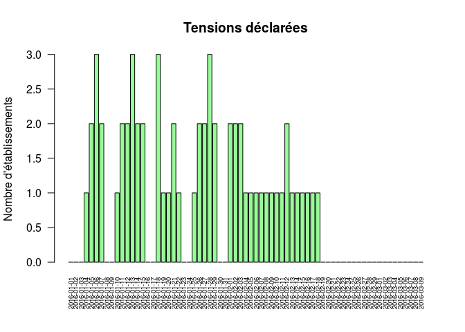

# Jours de tensions
JcB & Leslie Buisson  
08/03/2016  


```r
file <- "Tensions_2015-2016.csv"
d <- read.csv(file)
d <- d[-1,]
d$Date <- as.Date(d$Date)
barplot(d[,2], names.arg = d$Date, las = 2, cex.names = 0.6, ylab = "Nombre d'établissements", main = "Tensions déclarées", col = "palegreen")
```



