# Analyse des indicateurs HET
RESURAL - JcB  
13 avril 2016  


Méthodologie
============

Evolution des indicateurs de tension au cours du premier trimestre 2016. Pour facikiter les comparaison, les valeurs des indicateurs ont été normalisés selon la procédure suivante:

- la moyenne et l'écart-type de chaque indicateur et pour chaque établissement ont été calculés sur un échantillon de référence constitué à partir des RPU remontés entre novembre 2014 et novembre 2015.
- pour chacune des jounées du 1er trimestre 2016, la valeur de chaque indicateur a été calculée en valeur absolue. Par exemple, pour l'indicateur nombre de passages (HET1), on établi le nombre de passages par jour par établissement. A chacun de ces indicateurs, on retranche la valeur moyenne de l'indicateur obtenu pendant la période de réféence et on divise le résultat par l'écart-type de référence.
- les valeurs absolue de chaque indicateur pour chaque jour sont ainsi centrée et réduite. Les variations de chaque indicateurs ne sont plus mesurées en valeurs absolues mais en nombre d'écart-type par rapport à la moyenne. Plus on s'écarte de la moyenne et plus la situation est anormale.
- on représente graphiquement les indicateurs
  - soit sous forme de polygones en radar pour visualiser un état instantanné
  - soit sous forme d'un graphique temporel qui montre les variations del'indicateur sur la période.
  
Les graphiques qui suivent montrent la vaiation temporelle de l'indicateur. La valeur de référence est le zéro qui correspond à l'activité moyenne mesurée sur la période 2014-2015.


Analyse des indicateurs
=======================

Indicateur HET1: nombre de passages
------------------------------------


```
##  [1] "3Fr" "Alk" "Ane" "Col" "Dia" "Dts" "Emr" "Geb" "Hag" "Hsr" "HTP"
## [12] "NHC" "Odi" "Ros" "Sav" "Sel" "Tan" "Wis"
```

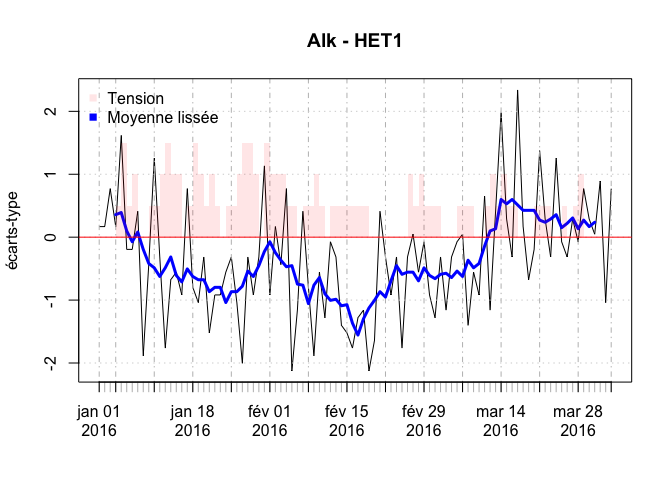

Indicateur HET2: nombre de passages de 75 ans ou plus
-----------------------------------------------------


Indicateur HET3: durée moyenne de passage
-----------------------------------------

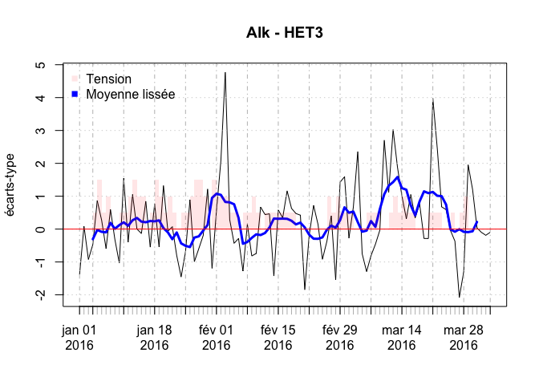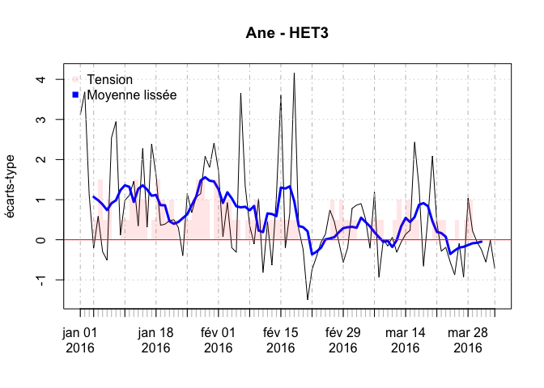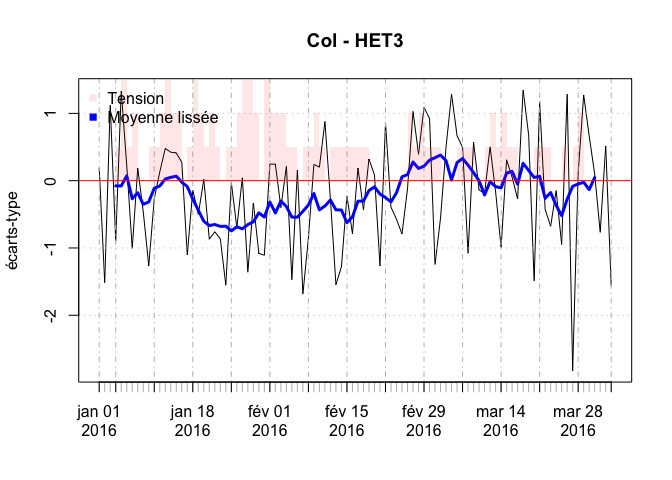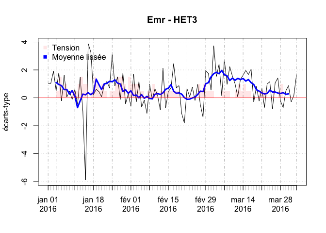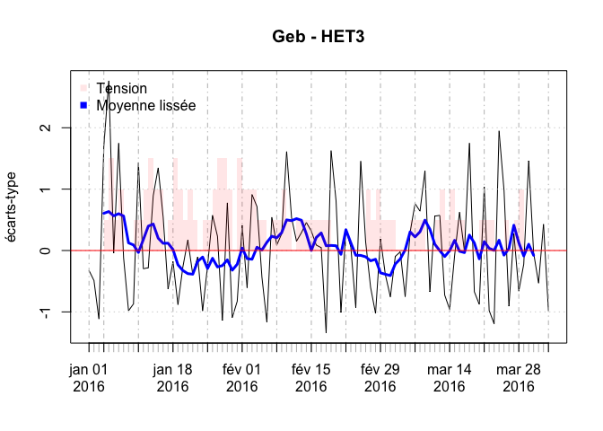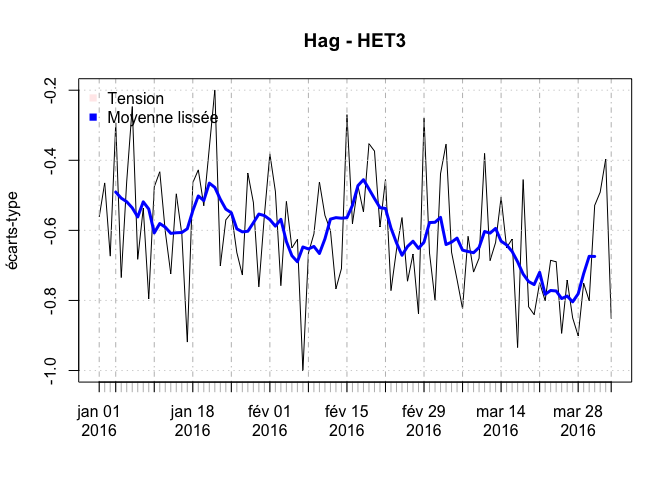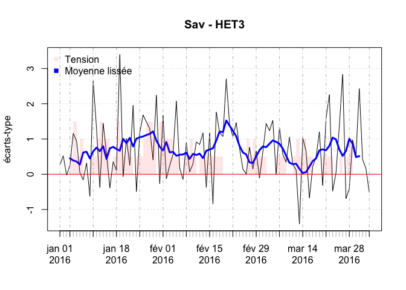

Indicateur HET4: Taux d'hospitalisation
--------------------------------------

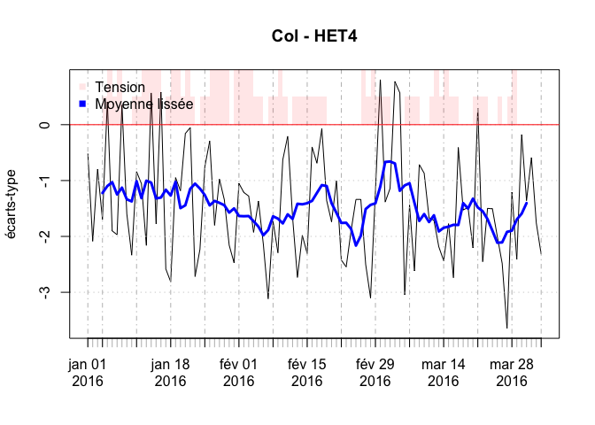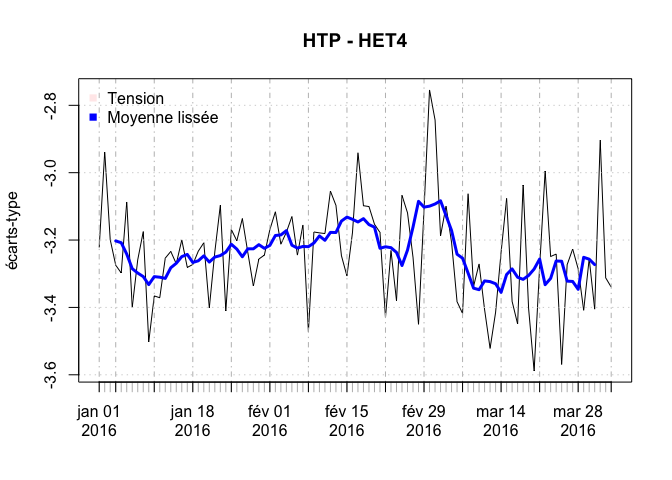

Indicateur HET5: charge de soins à 15h
--------------------------------------

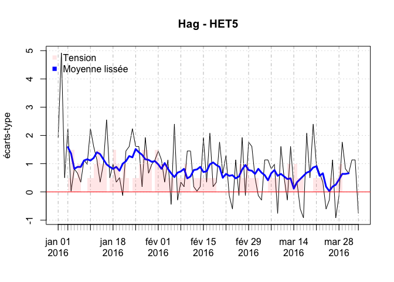
