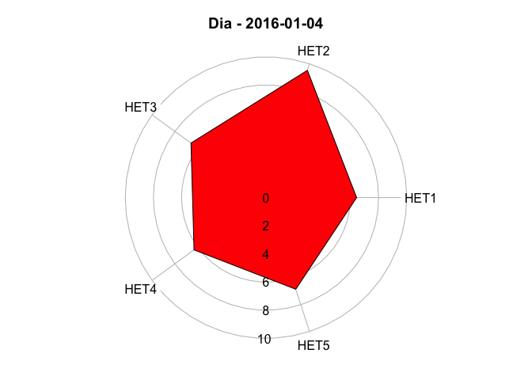
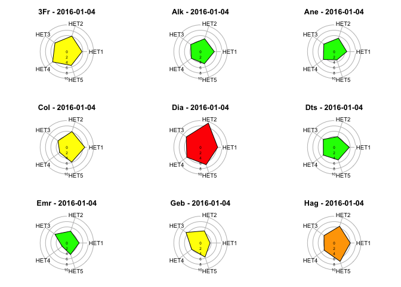
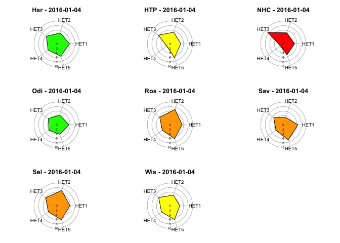

# Radars
ARS ZDS Est - JcB  
14 avril 2016  

Fichier des moyennes:


Matrices indicateur 2016


```r
indic = 1
het <- read.csv(paste0("../mat_het", indic, ".csv"))
# het <- read.csv(paste0("Tests/Matrice_indicateurs/mat_het", indic, ".csv"))
het <- rename.het(het)
cr1 <- cr(het, indic)
```


```r
indic = 2
het <- read.csv(paste0("../mat_het", indic, ".csv"))
# ajout d'une colonne vide pour Hsr
a <- het[, 1:10]
a$Hsr <- 0
het <- cbind(a, het[, 11:18])
het <- rename.het(het)
cr2 <- cr(het, indic)
```


```r
indic = 3
het <- read.csv(paste0("../mat_het", indic, ".csv"))
het <- rename.het(het)
cr3 <- cr(het, indic)
```


```r
indic = 4
het <- read.csv(paste0("../mat_het", indic, ".csv"))
het <- rename.het(het)
cr4 <- cr(het, indic)
```


```r
indic = 5
het <- read.csv(paste0("../mat_het", indic, ".csv"))
het <- rename.het(het)
cr5 <- cr(het, indic)
head(cr5)
```

```
##                    3Fr        Alk       Ane       Col       Dia
## 2016-01-01 -1.74004647 -1.0927267 -1.726379 0.9630446 0.3321851
## 2016-01-02  0.78742296 -0.2383911 -1.415209 0.4727673 0.7652120
## 2016-01-03  0.06528884 -1.0927267 -1.726379 1.3307525 0.9817255
## 2016-01-04  0.42635590 -0.2383911 -1.726379 0.8404753 1.8477794
## 2016-01-05 -0.65684528  0.1887767 -1.415209 0.4727673 1.1982390
## 2016-01-06 -1.01791234 -0.6655589 -1.415209 0.2276287 0.5486985
##                    Dts        Emr        Geb        Hag        Hsr
## 2016-01-01 -1.41634722 -0.3185730  1.6670660 1.92291754  0.4717167
## 2016-01-02  0.87906858  0.2678909 -0.5977445 4.92234019  4.4209726
## 2016-01-03  0.41998542  1.2942028 -0.9752129 0.50213838  1.1299260
## 2016-01-04 -0.03909774 -0.4651890  0.5346607 2.23864624  0.8008213
## 2016-01-05  1.33815173  2.7603625  0.5346607 0.02854533  0.4717167
## 2016-01-06 -0.49818090  0.2678909 -0.5977445 0.81786709 -0.5155973
##                   HTP        NHC        Odi         Ros        Sav
## 2016-01-01  0.1124305  0.5696610  2.1881216 -0.08554356  0.1892031
## 2016-01-02  3.2813325  0.9465422  1.8417582 -0.60593354  2.0726342
## 2016-01-03 -0.1139196  1.5118641  1.1490314 -0.60593354 -0.6478774
## 2016-01-04  1.4705314  0.1927797 -0.5827856  1.47562638  2.0726342
## 2016-01-05  0.2256056 -0.3725422  3.2272119 -0.08554356  1.4448239
## 2016-01-06  0.7914809 -0.9378640  2.8808485 -1.12632352  0.3984732
##                   Sel        Wis
## 2016-01-01  0.4213774 -1.6348177
## 2016-01-02  3.0835276 -0.4880365
## 2016-01-03 -0.4660060 -0.8702969
## 2016-01-04  1.4862375  1.4232654
## 2016-01-05  0.4213774 -0.1057762
## 2016-01-06  0.2439007  2.9523069
```

une journée

```r
rad <- function(jour, finess, m = 5){
    xt <- NULL
    xt[1] <- m + cr1[which(rownames(cr1) == jour), finess]
    xt[2] <- m + cr2[which(rownames(cr2) == jour), finess]
    xt[3] <- m + cr3[which(rownames(cr3) == jour), finess]
    xt[4] <- m + cr4[which(rownames(cr4) == jour), finess]
    xt[5] <- m + cr5[which(rownames(cr5) == jour), finess]
    xt[is.na(xt)] <- m # évite les NA qui font planter le graphique
    xt
}

jour <- "2016-01-04"
finess <- "Dia"

n <- seq(as.Date(jour), as.Date(jour) + 10, 1)

xt <- rad(jour, finess)
xt
```

```
## [1] 6.438374 9.508706 6.592075 6.320673 6.847779
```

```r
cr1[which(rownames(cr1) == jour), finess]
```

```
## [1] 1.438374
```

```r
radar.het(xt, date = paste(finess, "-", jour))
```



```r
# for(i in 1:length(n)){
#     xt <- rad(n[i], finess)
#     radar.het(xt, date = paste(finess, "-", n[i]))
# }

# liste des finess
fin <- names(het)[-1]

# affichage en deux fois
par(mfrow = c(3, 3), mar = c(1, 1, 1, 0))
for(i in 1:9){
    xt <- rad(jour = jour, finess = fin[i])
    radar.het(xt, date = paste(fin[i], "-", jour))
}
```



```r
for(i in 10:length(fin)){
    xt <- rad(jour = jour, finess = fin[i])
    radar.het(xt, date = paste(fin[i], "-", jour))
}
```



Représentation sous forme de cartes
-----------------------------------


