# Matrice indicateur
ARS ZDS Est - JcB  
11 avril 2016  


Calcul des indicateurs par matrice
==================================

Pour une période donnée (par ex. 3 mois) on peut calculer en une passe la matrice de chaque indicateur pour tous les Finess. On obtient une matrice rectangulaire avec une colonne par finess et une ligne par jour de la période. Ce mode de calcul se révèle être beaucoup plus rapide qu'une boucle for.

On choisit un finess de référence pour les graphiques:

```r
finess <- "Sel"
```

On prélève un dataframe: ici les 3 premiers mois de 2016 pour tous les finess:

```r
load("../../../RPU_2016/Data/rpu2016d0112_provisoire.Rda")
dx <- d16
library(xts)
```

```
## Loading required package: zoo
```

```
## 
## Attaching package: 'zoo'
```

```
## The following objects are masked from 'package:base':
## 
##     as.Date, as.Date.numeric
```

```r
library(Rpu2)
```

```
## Loading required package: lubridate
```

```
## 
## Attaching package: 'lubridate'
```

```
## The following object is masked from 'package:base':
## 
##     date
```

```
## Loading required package: xtable
```

```
## Loading required package: openintro
```

```
## Please visit openintro.org for free statistics materials
```

```
## 
## Attaching package: 'openintro'
```

```
## The following object is masked from 'package:datasets':
## 
##     cars
```

```
## Loading required package: plotrix
```

```r
source('../../het.R')

# lecture du fichier des moyennes
mean.ref <- read.csv("../../HET Alsace 2015/het_mean.csv")
rownames(mean.ref) <- mean.ref$X
mean.ref <- mean.ref[order(mean.ref$X),]
mean.ref <- mean.ref[, -1]
names(mean.ref) <- c("ahet1", "ahet2", "ahet3", "ahet4", "ahet5")

# lectures des ecarts-type de référence
sd.ref <- read.csv("../../HET Alsace 2015/het_sd.csv")
rownames(sd.ref) <- sd.ref$X
sd.ref <- sd.ref[order(sd.ref$X),]
sd.ref <- sd.ref[, -1]
names(sd.ref) <- c("ahet1", "ahet2", "ahet3", "ahet4", "ahet5")
```

```


HET1:nombre de pasages
----------------------

```r
# création de la matrice
a <- tapply(as.Date(dx$ENTREE), list(as.Date(dx$ENTREE), dx$FINESS), length)

# récupération desmoyennes et sd
m <- mean.ref[finess, 1]
s <- sd.ref[finess, 1]

# transformation en ts
ats <- xts(a, order.by = as.Date(rownames(a)))
plot(ats[, finess], main = finess)
abline(h = m)
abline(h = m + s, col = "yellow", lty = 2)
abline(h = m - s, col = "yellow", lty = 2)
```

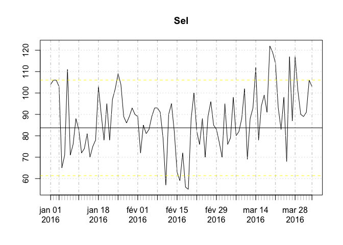

```r
# variante centrée réduite
plot((ats[, finess]-m)/s, main = finess, ylim = c(-3,3))
```

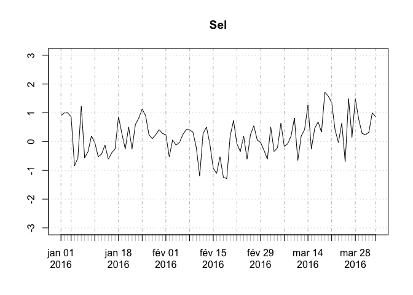

```r
# sauvegarde de la matrice HET1
write.csv(a, file = "mat_het1.csv")
```

HET2: Plus de 75 ans
--------------------

```r
# création de la matrice
age <- dx[dx$AGE > 74,]
c <- tapply(as.Date(age$ENTREE), list(as.Date(age$ENTREE), age$FINESS), length)

# récupération des moyennes et sd
m <- mean.ref[finess, 2]
s <- sd.ref[finess, 2]

# 
cts <- xts(c, order.by = as.Date(rownames(c)))
plot(cts[, finess], main = finess)
```

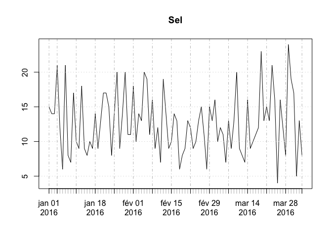

```r
# variante centrée réduite
plot((cts[, finess]-m)/s, main = paste(finess, "- 75 ans et plus"), ylim = c(-3,3))
abline(h = 0, col = "red")
```

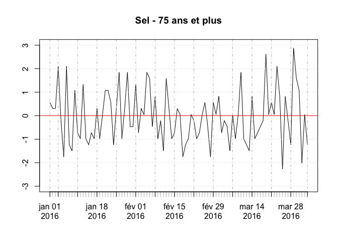

```r
# sauvegarde de la matrice HET2
write.csv(c, file = "mat_het2.csv")
```


Het3: durée moyenne de passage
------------------------------

```r
# création de la matrice
hosp <- dx[!is.na(dx$MODE_SORTIE), ]
# dp <- df.duree.pas.finess(hosp, unit = "mins", mintime = 0, maxtime = 3, finess = TRUE)
dp <- df.duree.pas(hosp, unit = "mins", mintime = 0, maxtime = 3)
b <- tapply(dp$duree, list(as.Date(dp$ENTREE), dp$FINESS), mean)
```

```r
# transformation en ts
bts <- xts(b, order.by = as.Date(rownames(b)))
plot(bts[, finess], main = paste(finess, "- Durée moyenne de passage"), ylab = "minutes")
```

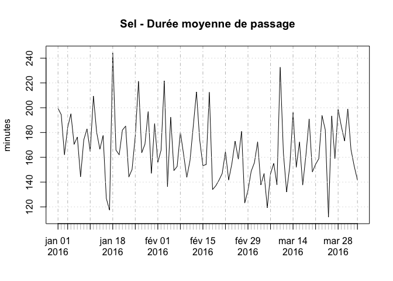

```r
# version centrée et réduite
m <- mean.ref[finess, 3]
s <- sd.ref[finess, 3]
plot((bts[, finess]-m)/s, main = finess, ylim = c(-3,3))
abline(h = 0, col = "red")
```

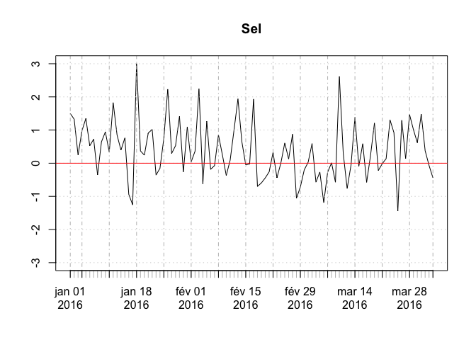

```r
# sauvegarde de la matrice HET3
write.csv(b, file = "mat_het3.csv")
```

### La méthode de normalisation permet de superposer les graphes
on supperpose HET1 et HET3:

```r
# HET1
m <- mean.ref[finess, 1]
s <- sd.ref[finess, 1]
plot((ats[, finess]-m)/s, main = finess, ylim = c(-3,3))
# HET3
m <- mean.ref[finess, 3]
s <- sd.ref[finess, 3]
lines((bts[, finess]-m)/s, main = finess, ylim = c(-3,3), col = "green")
```

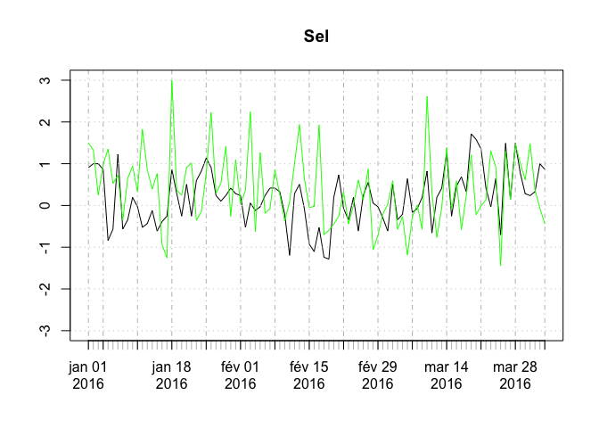

HET4: (Taux d'hospitalisation)
----------------------------- 

```r
# création de la matrice: 
# - on récupère la matrice a = nb de RPU par jour et par finess
# - on crée la matrice des patients hospitalisés = MODE_SORTIE est Mutation ou transfert à partir de hosp créé pour HET3
hospit <- hosp[hosp$MODE_SORTIE %in% c("Mutation","TRANSFERT"), ]
d <- tapply(as.Date(hospit$ENTREE), list(as.Date(hospit$ENTREE), hospit$FINESS), length)
# taux hospitalisation par finess et par jour
e <- d/a

# transformation en ts
ets <- xts(e, order.by = as.Date(rownames(e)))
plot(ets[, finess], main = paste(finess, "- Taux hospitalisation"), ylab = "minutes")
abline(h = 0, col = "red")
```

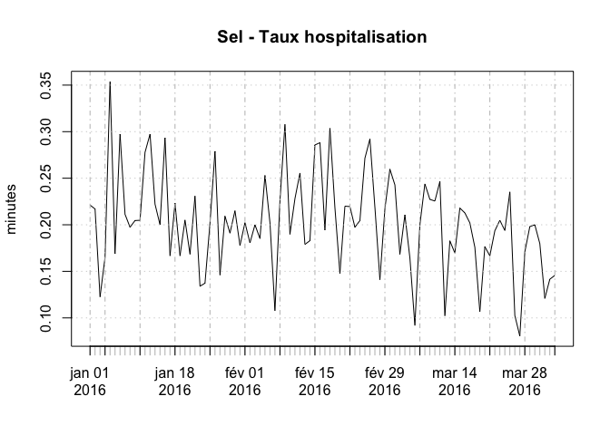

```r
# moyenne et sd
indicateur <- "ahet4"
m <- mean.ref[finess, indicateur]
s <- sd.ref[finess, indicateur]

# Centrage
plot((ets[, finess]-m)/s, main = finess, ylim = c(-3,3))
abline(h = 0, col = "red")
```

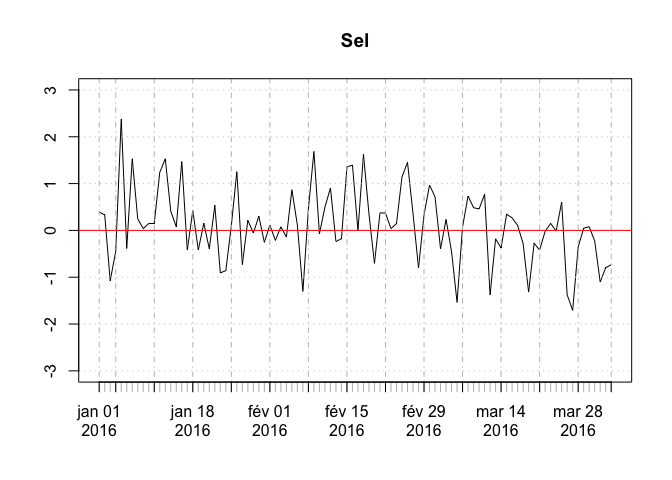

```r
# sauvegarde de la matrice HET4
write.csv(e, file = "mat_het4.csv")
```

HET5: (charge de soins)
-----------------------

```r
dp$present.a.15h <- is.present.at(dp)
# nombre moyen de patients présents à 15h tous les jours
n.p15 <- tapply(dp$present.a.15h, list(as.Date(dp$ENTREE), dp$FINESS), sum)

# transformation en ts
npts <- xts(n.p15, order.by = as.Date(rownames(n.p15)))
plot(npts[, finess], main = paste(finess, "- Charge de soins à 15h"), ylab = "nombre de patients")

# moyenne et sd
indicateur <- "ahet5"
m <- mean.ref[finess, indicateur]
s <- sd.ref[finess, indicateur]

abline(h = m, col = "red")
```

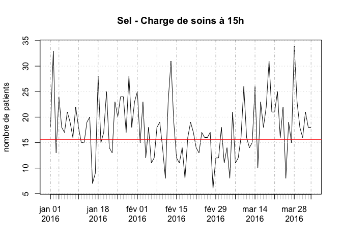

```r
# Centrage
plot((npts[, finess]-m)/s, main = finess, ylim = c(-3,3))
abline(h = 0, col = "red")
```

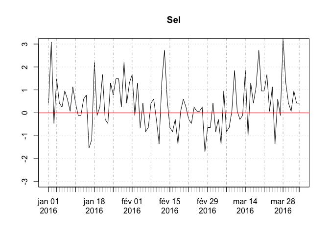

```r
# sauvegarde de la matrice HET1
write.csv(n.p15, file = "mat_het5.csv")
```

Pour l'ensemble de la région Alsace
===================================

Création de la matrice de référence
-----------------------------------

```r
# récupération du DF de référence
load("../../HET ALSACE 2015/ref_2015.R")

# moyenne passage (HET1)
n <- tapply(as.Date(ref.2015$ENTREE), as.Date(ref.2015$ENTREE), length)
m.het1 <- mean(n)
s.het1 <- sd(n)

# plus de 75 ans
ger <- ref.2015[ref.2015$AGE > 74,]
n <- tapply(as.Date(ger$ENTREE), as.Date(ger$ENTREE), length)
m.het2 <- mean(n)
s.het2 <- sd(n)

# durée moyenne de passage (het3)
hosp <- ref.2015[!is.na(ref.2015$MODE_SORTIE), ]
dp <- df.duree.pas(hosp, unit = "mins", mintime = 0, maxtime = 3)
b <- tapply(dp$duree, as.Date(dp$ENTREE), mean)
m.het3 <- mean(b)
s.het3 <- sd(b)

# taux d'hospitalisation
hospit <- hosp[hosp$MODE_SORTIE %in% c("Mutation","TRANSFERT"), ]
d <- tapply(as.Date(hospit$ENTREE), as.Date(hospit$ENTREE), length)
# nb de mode de sortie renseigné par jour
n.ms <- tapply(as.Date(hosp$ENTREE), as.Date(hosp$ENTREE), length)
# taux hospitalisation par finess et par jour
e <- d/n.ms

m.het4 <- mean(e)
s.het4 <- sd(e)

# charge de soins
dp$present.a.15h <- is.present.at(dp)
# nombre moyen de patients présents à 15h tous les jours
n.p15 <- tapply(dp$present.a.15h, as.Date(dp$ENTREE), sum)

m.het5 <- mean(n.p15)
s.het5 <- sd(n.p15)
```


```r
# Ajout des tensions
tension.file <- read.csv("../../Jours_de_tension/Tensions_2015-2016.csv")
tension <- tension.file[2:89, 1:2]
tension$Date <- as.Date(tension$Date)
col.tension <- rgb(1, 0, 0, 0.3)

# et une fonction pour les dessiner
tension.plot <- function(){
    # Ajout des tensions.il faut transforer les dates en temps unix
    for(j in 1:nrow(tension)){
    rect(as.numeric(as.POSIXct(tension[j,1])), 0, 
    as.numeric(as.POSIXct(tension[j,1]+1)), 
        0.5 * tension[j,2],
        col = col.tension, border = NA)
    }
    legend("topleft", legend = c("Tension", "Moyenne lissée"), col = c(col.tension, "blue"), pch = c(15,15), bty = "n")
}
```


HET1:nombre de pasages
----------------------

```r
# création de la matrice
a <- tapply(as.Date(dx$ENTREE), as.Date(dx$ENTREE), length)

# centrage - réduction
a2 <- (a - m.het1)/s.het1

# transformation en ts
a2ts <- xts(a2, order.by = as.Date(rownames(a2)))
plot(a2ts, main = "HET1 - Nombre de RPU quotidien", ylab = "écart-type")
abline(h = 0, col = "red")
lines(rollmean(a2ts, 7), col = "blue", lwd = 3)

# sauvegarde de la matrice HET1
# write.csv(a, file = "mat_het1.csv")

tension.plot()
```

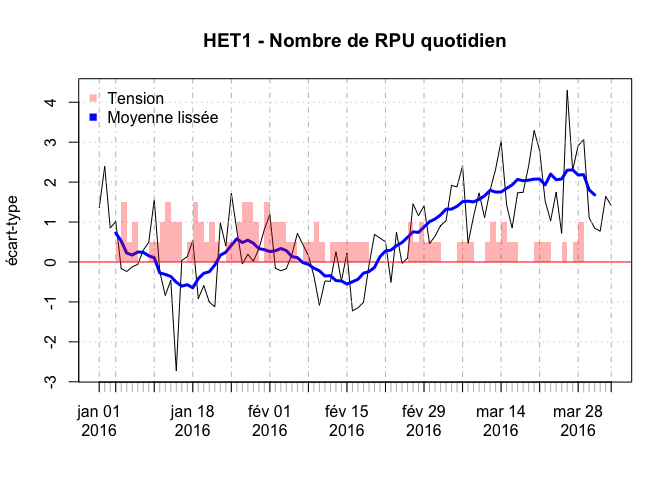

HET2 régional: plus e 75 ans
----------------------------

```r
ger <- dx[dx$AGE > 74, "ENTREE"]
b <- tapply(as.Date(ger), as.Date(ger), length)
b2 <- (b - m.het2)/s.het2
b2ts <- xts(b2, order.by = as.Date(names(b2)))
plot(b2ts, main = "HET2 - Age supérieur ou égal à 75 ans", ylab = "écart-type")
abline(h = 0, col = "red")
lines(rollmean(b2ts, 7), col = "blue", lwd = 3)

# Ajout des tensions.il faut transforer les dates en temps unix
tension.plot()
```

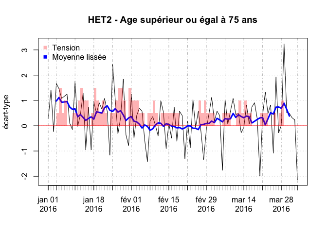

HET3 régional: durée moyenne de passage
---------------------------------------

```r
# création de la matrice
hosp <- dx[!is.na(dx$MODE_SORTIE), ]
dp <- df.duree.pas(hosp, unit = "mins", mintime = 0, maxtime = 3)
c <- tapply(dp$duree, as.Date(dp$ENTREE), mean)
c2 <- (c - m.het3)/s.het3

c2ts <- xts(c2, order.by = as.Date(names(c2)))
plot(c2ts, main = "HET3 - Durée de passage", ylab = "écart-type")
abline(h = 0, col = "red")
lines(rollmean(c2ts, 7), col = "blue", lwd = 3)

# Ajout des tensions.il faut transforer les dates en temps unix
tension.plot()
```

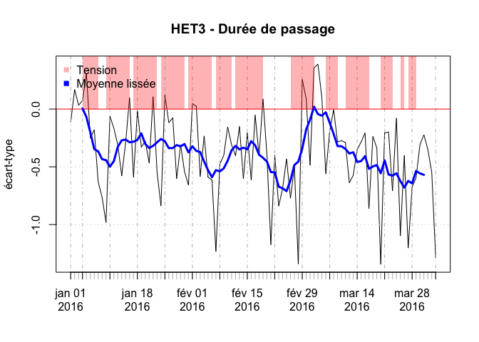

HET4: taux d'hospitalisation
----------------------------

```r
hospit <- hosp[hosp$MODE_SORTIE %in% c("Mutation","TRANSFERT"), ]
d <- tapply(as.Date(hospit$ENTREE), as.Date(hospit$ENTREE), length)
# nb de mode de sortie renseigné par jour
n.ms <- tapply(as.Date(hosp$ENTREE), as.Date(hosp$ENTREE), length)
# taux hospitalisation par finess et par jour
e <- d/n.ms

e2 <- (e - m.het4)/s.het4
e2ts <- xts(e2, order.by = as.Date(names(e2)))
plot(e2ts, main = "HET4 - Taux d'hospitalisation", ylab = "écart-type")
abline(h = 0, col = "red")
lines(rollmean(e2ts, 7), col = "blue", lwd = 3)

# Ajout des tensions.il faut transforer les dates en temps unix
tension.plot()
```

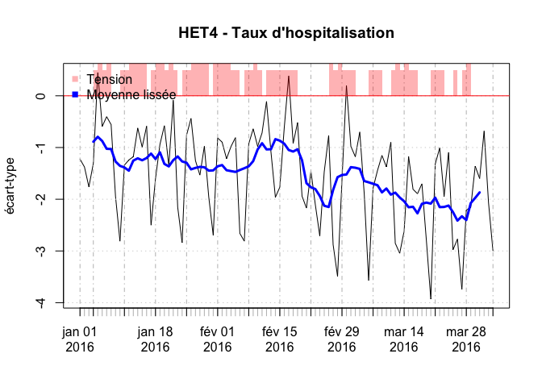

HET5: Charge de soins
-----------------------

```r
dp$present.a.15h <- is.present.at(dp)
# nombre moyen de patients présents à 15h tous les jours
n.p15 <- tapply(dp$present.a.15h, as.Date(dp$ENTREE), sum)
f2 <- (n.p15 - m.het5)/s.het5

f2ts <- xts(f2, order.by = as.Date(names(f2)))
plot(f2ts, main = "HET5 - Charge de soins", ylab = "écart-type", ylim = c(-1,6))
abline(h = 0, col = "red")
lines(rollmean(f2ts, 7), col = "blue", lwd = 3)

# Ajout des tensions.il faut transforer les dates en temps unix
tension.plot()
```

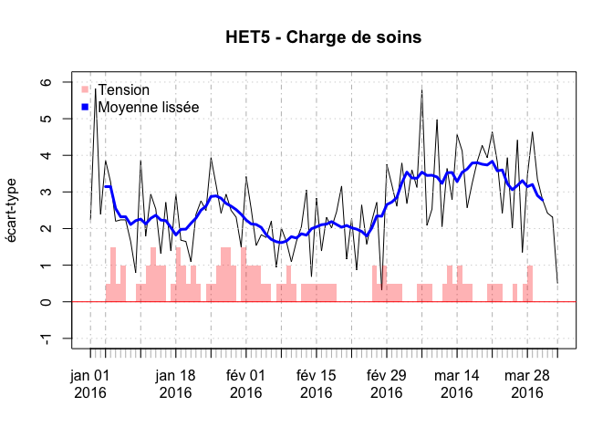

Cas particulier du T3
=====================

Création de la matrice de référence
------------------------------------


```r
t3ref <- ref.2015[ref.2015$FINESS %in% c("Col", "Sel", "Geb"),]

# moyenne passage (HET1)
n <- tapply(as.Date(t3ref$ENTREE), as.Date(t3ref$ENTREE), length)
m.het1 <- mean(n)
s.het1 <- sd(n)

# plus de 75 ans
ger <- t3ref[t3ref$AGE > 74,]
n <- tapply(as.Date(ger$ENTREE), as.Date(ger$ENTREE), length)
m.het2 <- mean(n)
s.het2 <- sd(n)

# durée moyenne de passage (het3)
hosp <- t3ref[!is.na(t3ref$MODE_SORTIE), ]
dp <- df.duree.pas(hosp, unit = "mins", mintime = 0, maxtime = 3)
b <- tapply(dp$duree, as.Date(dp$ENTREE), mean)
m.het3 <- mean(b)
s.het3 <- sd(b)

# taux d'hospitalisation
hospit <- hosp[hosp$MODE_SORTIE %in% c("Mutation","TRANSFERT"), ]
d <- tapply(as.Date(hospit$ENTREE), as.Date(hospit$ENTREE), length)
# nb de mode de sortie renseigné par jour
n.ms <- tapply(as.Date(hosp$ENTREE), as.Date(hosp$ENTREE), length)

# pb: d be ompte que 364 jours contre 365 pour n.ms ce qui rend la division impossible. On fait d'abord un merging ce qui perùet de faire le rappor des deux sur 364 jours:
a <- cbind(rownames(d), d)
b <- cbind(rownames(n.ms), n.ms)
m <- merge(a,b)
m$V1 <- as.Date(m$V1)
m$d <- as.numeric(as.character(m$d))
m$n.ms <- as.numeric(as.character(m$n.ms))
m$r <- m$d/m$n.ms

# taux hospitalisation par jour
e <- m$r

m.het4 <- mean(e)
s.het4 <- sd(e)

# charge de soins
dp$present.a.15h <- is.present.at(dp)
# nombre moyen de patients présents à 15h tous les jours
n.p15 <- tapply(dp$present.a.15h, as.Date(dp$ENTREE), sum)

m.het5 <- mean(n.p15)
s.het5 <- sd(n.p15)
```

Graphes centrés
----------------

### fichier de référence

```r
t3 <- dx[dx$FINESS %in% c("Col","Sel","Geb"),]
```


### HET1:nombre de pasages


```r
# création de la matrice
a <- tapply(as.Date(t3$ENTREE), as.Date(t3$ENTREE), length)

# centrage - réduction
a2 <- (a - m.het1)/s.het1

# transformation en ts
a2ts <- xts(a2, order.by = as.Date(rownames(a2)))
plot(a2ts, main = "HET1 - Nombre de RPU quotidien du T3", ylab = "écart-type")
abline(h = 0, col = "red")
lines(rollmean(a2ts, 7), col = "blue", lwd = 3)

tension.plot()
```

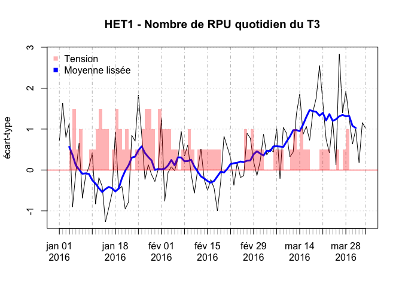

HET2 régional: plus e 75 ans
----------------------------

```r
ger <- t3[t3$AGE > 74, "ENTREE"]
b <- tapply(as.Date(ger), as.Date(ger), length)
b2 <- (b - m.het2)/s.het2
b2ts <- xts(b2, order.by = as.Date(names(b2)))
plot(b2ts, main = "HET2 - Age supérieur ou égal à 75 ans T3", ylab = "écart-type")
abline(h = 0, col = "red")
lines(rollmean(b2ts, 7), col = "blue", lwd = 3)

# Ajout des tensions.il faut transforer les dates en temps unix
tension.plot()
```

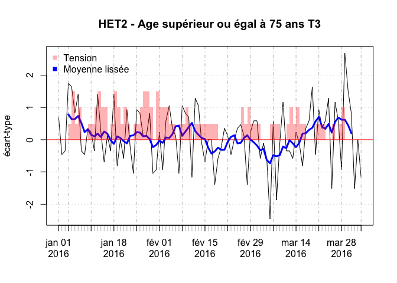

### HET3 régional: durée moyenne de passage


```r
# création de la matrice
hosp <- t3[!is.na(t3$MODE_SORTIE), ]
dp <- df.duree.pas(hosp, unit = "mins", mintime = 0, maxtime = 3)
c <- tapply(dp$duree, as.Date(dp$ENTREE), mean)
c2 <- (c - m.het3)/s.het3

c2ts <- xts(c2, order.by = as.Date(names(c2)))
plot(c2ts, main = "HET3 - Durée de passage T3", ylab = "écart-type")
abline(h = 0, col = "red")
lines(rollmean(c2ts, 7), col = "blue", lwd = 3)

# Ajout des tensions.il faut transforer les dates en temps unix
tension.plot()
```

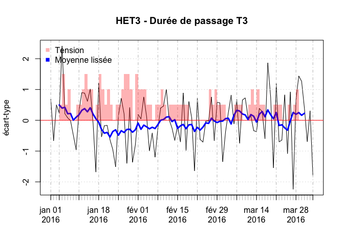

### HET4: taux d'hospitalisation

```r
hospit <- hosp[hosp$MODE_SORTIE %in% c("Mutation","TRANSFERT"), ]
d <- tapply(as.Date(hospit$ENTREE), as.Date(hospit$ENTREE), length)
# nb de mode de sortie renseigné par jour
n.ms <- tapply(as.Date(hosp$ENTREE), as.Date(hosp$ENTREE), length)
# taux hospitalisation par finess et par jour
e <- d/n.ms

e2 <- (e - m.het4)/s.het4
e2ts <- xts(e2, order.by = as.Date(names(e2)))
plot(e2ts, main = "HET4 - Taux d'hospitalisation T3", ylab = "écart-type")
abline(h = 0, col = "red")
lines(rollmean(e2ts, 7), col = "blue", lwd = 3)

# Ajout des tensions.il faut transforer les dates en temps unix
tension.plot()
```

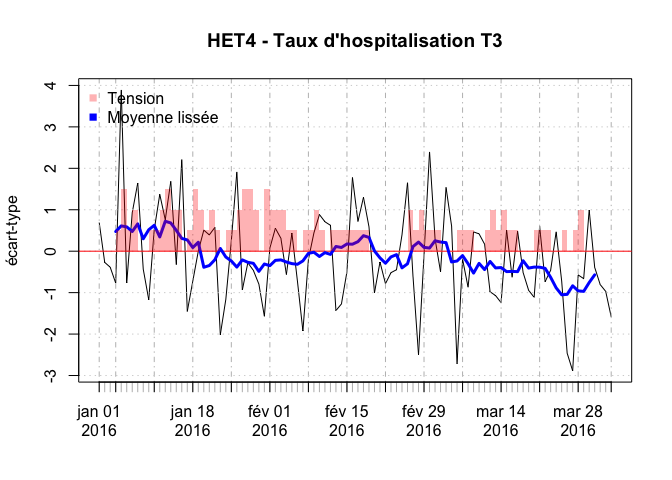

### HET5: charge de soins

```r
dp$present.a.15h <- is.present.at(dp)
# nombre moyen de patients présents à 15h tous les jours
n.p15 <- tapply(dp$present.a.15h, as.Date(dp$ENTREE), sum)
f2 <- (n.p15 - m.het5)/s.het5

f2ts <- xts(f2, order.by = as.Date(names(f2)))
plot(f2ts, main = "HET5 - Charge de soins T3", ylab = "écart-type")
abline(h = 0, col = "red")
lines(rollmean(f2ts, 7), col = "blue", lwd = 3)

# Ajout des tensions.il faut transforer les dates en temps unix
tension.plot()
```

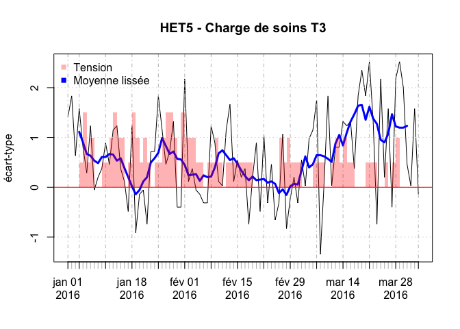
