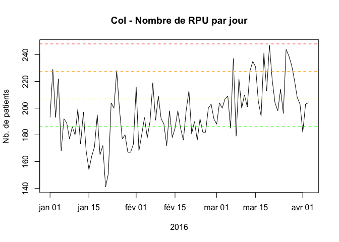

# Indicateurs de tensions hospitalières
RESURAL  
31/01/2016  

HET1 (nombre de passages)
-------------------------

HET2 (nombre de personnes de 75 ans ou plus)
--------------------------------------------

HET3 (durée moyenne de passage)
-------------------------------

HET4 (Taux d'hospitalisation)
-----------------------------

HET5 (charge de soins)
----------------------

